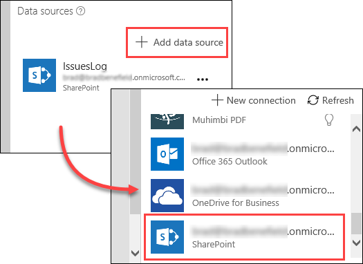
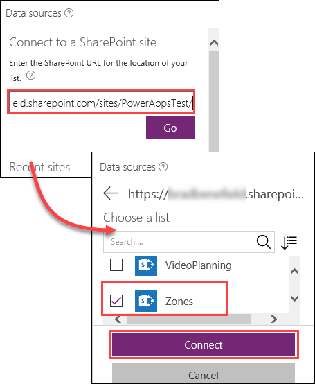
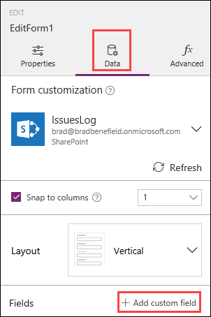
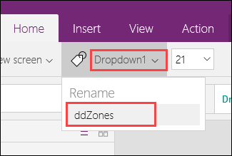
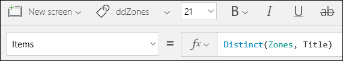
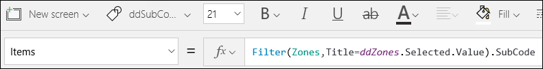
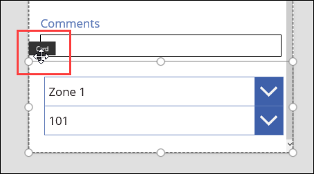

<properties
   pageTitle="Add a cascading drop-down list | Microsoft PowerApps"
   description="Add a data source and then add some cascading drop-down lists"
   services=""
   suite="powerapps"
   documentationCenter="na"
   authors="v-subohe"
   manager="anneta"
   editor=""
   tags=""/>

<tags
   ms.service="powerapps"
   ms.devlang="na"
   ms.topic="get-started-article"
   ms.tgt_pltfrm="na"
   ms.workload="na"
   ms.date="08/05/2017"
   ms.author="v-subohe"/>

# Cascading drop-down lists
In the last topic, you learned some basic information about forms and how forms combine with columns in our SharePoint lists. You also learned about locking and unlocking property settings in order to customize forms.

In this topic, you'll add a set of cascading drop-down controls so that when a user selects a Zone, a drop-down list will display the available subcodes, or Division Codes, for that zone. Then, you'll update the Division Code field with the selected subcode. 

## Add a data source to use for the cascading drop-down list 

You already have a data source connection to **IssuesLog** that was created in the previous topic. Now, connect to the **Zones** data source that has the data you'll need for the cascading drop-down lists.

1. In the middle pane, click or tap anywhere outside the app screen.

1. In the right-hand pane, click or tap **Add data source**. In the list of connections, click or tap the SharePoint connection you want to use.

   **Note:** If you don't see the connection you want to use, click or tap **New connection**.

   

1. Under **Connect to a SharePoint site**, copy and paste the URL for the SharePoint site (in the example, it's https://microsoft.sharepoint.com/teams/PlanningTeamSite), and then click or tap **Go**.

   **Note:** Be sure to connect to the site itself first, not the list.

   PowerApps searches for all of the lists that are available on the SharePoint site. In the list, find **Zones** and select it. Then, click or tap **Connect**. In the right-hand pane, notice that there are now two data sources in the list.

   

## Add cascading drop-down lists
Now that you've added the **Zones** connection, add the cascading drop-down lists to the form. You'll add drop-down lists, one for the top-level **Zones**, and the second for the **Subcodes**.

1. In the left-hand pane, under **EditScreen1**, select **EditForm1**. 

1. Select **Data** in the right-hand pane, and then select **+ Add custom field**.

   
   
   PowerApps adds a blank card to the bottom of the form.

1. With the blank card selected, in the **Insert** tab, click or tap **Controls** and then click or tap **Drop down**.

   

   
1. Insert another drop-down like you just did, or copy and paste the one you created.
   
1. In the left pane, rename the first drop-down list **ddZones** and the second one **ddSubCodes**.

   

3. Click or tap the first drop-down list, **ddZones**, and select **Items** in the property list. In the formula bar next to **Items**, type the following: 

    **Distinct(Zones,Title)**

    **Note**: The **Distinct** function is used because there are multiple items in the **Zones** list in SharePoint that have the same value for **Title**. 

   

4. Click or tap the second drop-down list, **ddSubCodes**, and select **Items** in the property list. In the formula bar next to **Items**, type the following:

   **Filter(Zones,Title=ddZones.Selected.Value).SubCode**

   This formula retrieves the data in **Zones** where the **Title** field is equal to the value in **ddZones** and returns the subcodes.

      

5. Run the app to test the cascading drop-downs.

## Update the Division Code field 
Next, you'll configure the app to automatically update the **Division Code** field with the **SubCode** value that the user selected, so when the record is saved, the **Division Code** will also be written to the SharePoint record.   

**Note:** Remember that the zones  and sub codes are part of the **Zones** list, and are not part of the records that are saved to the **IssuesLog** list (which the app uses as the main data source). However, the **Division Code** field *is* saved to the **IssuesLog** list.

1. In the form, drag and drop the card you created for the drop-down lists to the space above the **Division Code** field.

   

2. Click or tap the **Divison Code** field, select **Advanced** in the right-hand pane, and unlock the field. 

1. Search for **Default**, then type the following: 

    **ddSubCodes.Selected.Value**

   This formula changes the default value of the **Division Code** field to whatever is selected in the **ddSubCodes** drop-down list.

3. Since the **Division Code** field simply displays the **ddSubCodes** selection, it doesn't need to be displayed to the user, and you can free up some screen space in your app by hiding it.  Select **Visible** in the property list for **Division Code**, and in the formula bar, type **false**. 
