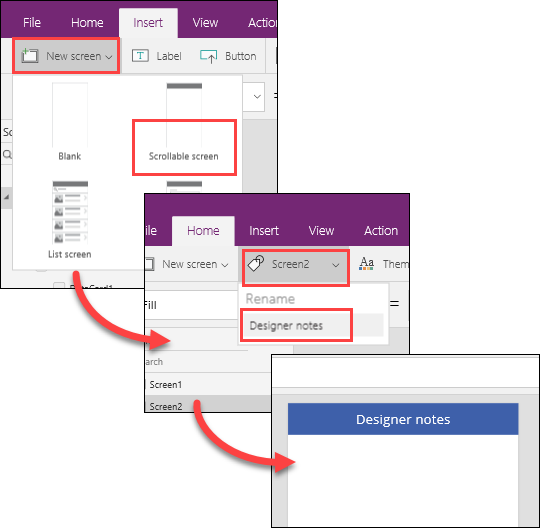
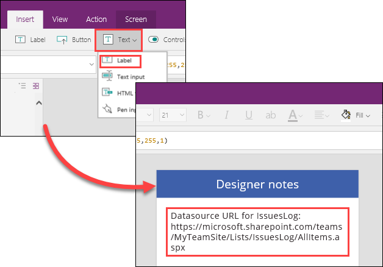
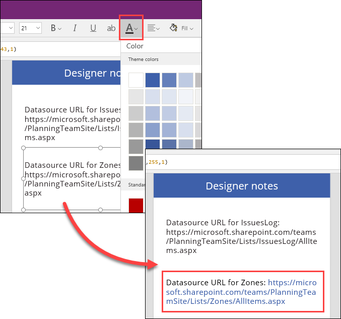
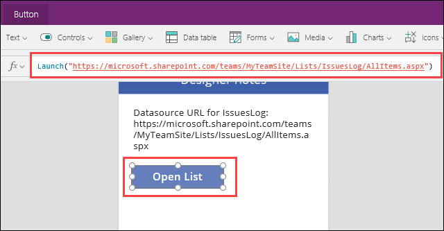
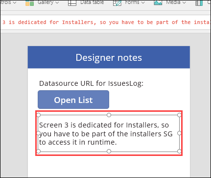
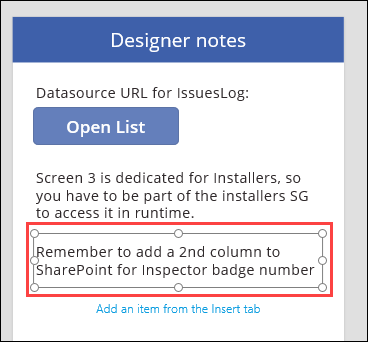

<properties
   pageTitle="Best Practices: Commenting and testing your apps | Microsoft PowerApps"
   description="Best practices for commenting and testing your PowerApp"
   services=""
   suite="powerapps"
   documentationCenter="na"
   authors="v-brbene"
   manager="anneta"
   editor=""
   tags=""
   featuredVideoId="os33pHQ9jSU"
   courseDuration="4m"/>

<tags
   ms.service="powerapps"
   ms.devlang="na"
   ms.topic="get-started-article"
   ms.tgt_pltfrm="na"
   ms.workload="na"
   ms.date="08/07/2017"
   ms.author="v-brbene"/>

# Commenting and testing your apps

In this topic, we’ll look at some best practices for documenting and testing your apps. As you’re building an app, it’s easy to keep track of things like data source locations, permissions for screens, and so on. However, you may not remember those details two months later when you update the app, or when someone else on your team may need to update it. So, you’ll want to document some details while you’re building the app to make it easy for other people to see what you’ve done. 

## Create a hidden screen

The easiest way to document details of your app, and make sure that it stays with your app, is to keep the notes in a hidden screen.  

In your app, click **New screen**, and then select **Scrollable**.  Name the screen **Designer notes**, and give it a title of **Designer notes**. 

By default, the new screen is "hidden" because it doesn’t have any navigation settings, so users will never be able to get to the screen when they're using the app.  Then, make a policy in your organization to always create a **Designer notes** page when you create an app, and to always edit the Designer notes content when you make significant changes. 

## Document your app
Probably the most important thing to document is the data source that is used for the app. You can document the URL for the data source in several ways:

- Add a label to the screen, and copy and paste the full URL from the data source, for example a SharePoint list or an Excel file. 

- Optionally, you can highlight the URL in color to make it easier to read. Click **Home**, highlight the URL, and select a color from the dropdown.  

- You can also include the URL in a button. On the **Insert** tab, click **Button**, and name it **Open List**.  In the **OnSelect** property of the button, use the **Launch** function to open your URL. For example:

  **Launch(“https://microsoft.sharepoint.com/teams/MyTeamSite/Lists/IssuesLog/AllItems.aspx”)** 

You can also add notes to track other features, such as any permissions that are required to run the app, for example:

Designer notes are also a good way to keep track of work items, such as bug fixes or new features, for example:

## Test your app

Lastly, you shouldn’t be the only person to test your app. **Always** have someone else test your app.
-  Someone who hasn’t worked closely with the app can often see design or functional mistakes that you may have missed.
- Someone with different permissions than you may find connection or functional issues in the app. 

Documenting your apps is an important policy for any organization. Whether you move to a different department, go on vacation, or have to remember details six months later, being able to update your apps quickly can reduce support issues, and increase productivity and user satisfaction. 

