<properties
   pageTitle="The Common Data Service: Advance Apps | Microsoft PowerApps"
   description="Building Advanced Applications with the Common Data Service"
   services=""
   suite="powerapps"
   documentationCenter="na"
   authors="v-brbene"
   manager="anneta"
   editor=""
   tags=""
   featuredVideoId="os33pHQ9jSU"
   courseDuration="7m"/>

<tags
   ms.service="powerapps"
   ms.devlang="na"
   ms.topic="get-started-article"
   ms.tgt_pltfrm="na"
   ms.workload="na"
   ms.date="08/03/2017"
   ms.author="v-brbene"/>

# Building advanced applications with the Common Data Service

In this topic, we’re going to talk about the different ways that you can build your apps with the Common Data Service. One of the great things about the Common Data Service is that we have application creation experiences for different skill levels. Let’s take a quick tour of some of these options:

- First, you can build your apps with PowerApps. Most of the steps in this process are automated. To create your application, you select the desired layout, choose the Common Data Service data source, find the entity you want to use, and then let PowerApps automatically build your app.
- Next, you can build an app that takes advantage of Azure Functions and custom connectors. The Azure Function can contain custom logic and complex queries that use the Common Data Service C# SDK.  To use this method, first register the app with Azure Active Directory, and then build your Azure Function. 
- A third way is to use the Common Data Service C# SDK in a middle tier, deploy that middle-tier, and then build a rich client application on top of that. 
- And finally, you can use the Common Data Service C# SDK directly in your web apps or SaaS applications. 

Let’s look at two of these options, starting with the PowerApps experience. 

## Create an app with PowerApps

1. On the PowerApps **Home** page, click **New app**.

    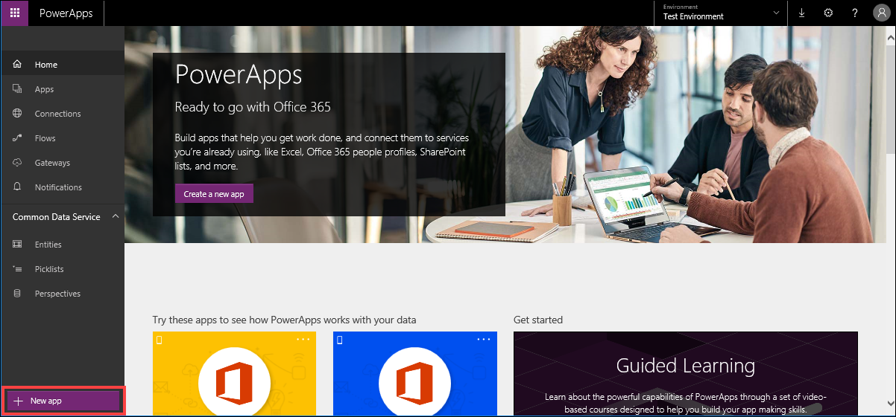

1. Under **Blank app**, click **Tablet layout**. 

    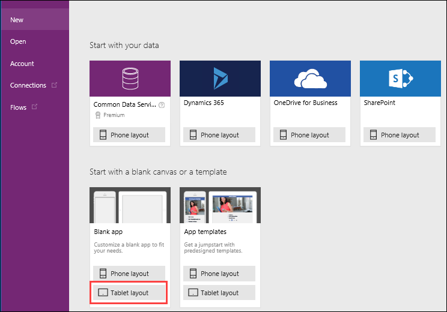

1. In the right pane, click the **Data** tab.

1. Click **Add Data Source**, click **Common Data Services**, select **Flooring Estimates**, and click **Connect**.

    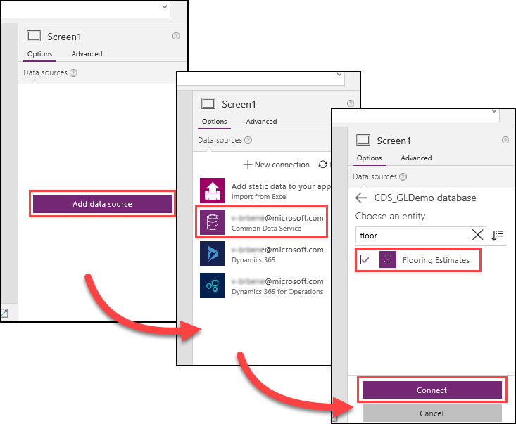

1. Click **Insert**, click **Forms**, and then select **Entity form**.

    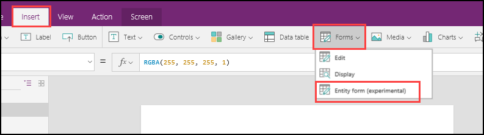

1. With the form selected, expand the data source list and select the entity that you connected to above. 

    

    The screen should now look like the following image.

    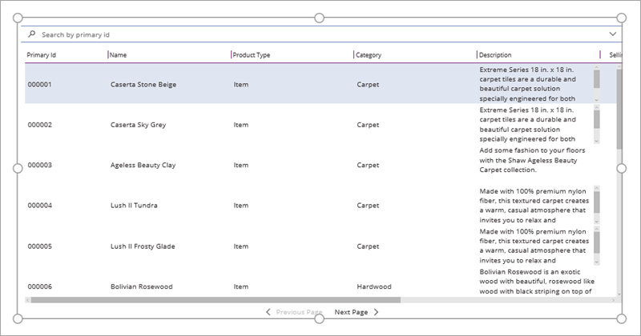

Next, we’ll create a second screen to view the details of each item. 

1. Click **New screen**, and click **Blank**. 

    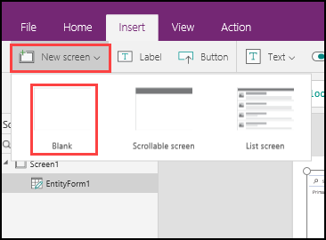

1. Add an entity form to this new screen and bind it to the Common Data Service entity using the same steps as above.

1. Select the form and click the **Properties** tab. Select **Details** from the **Pattern** drop-down list. 

    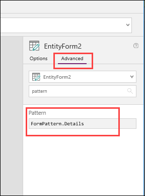

    The second screen should now look like the following image.

    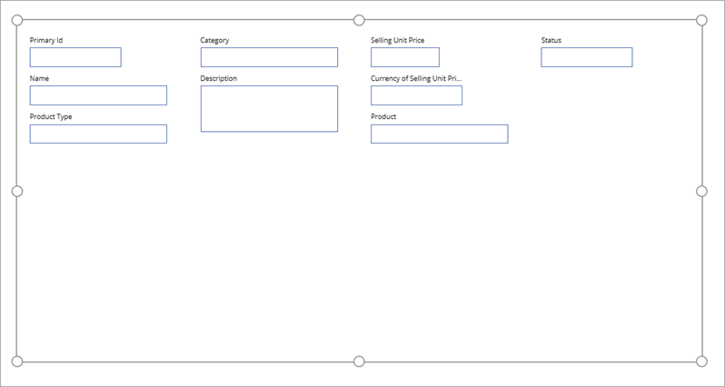

1. Click on the first screen, click the entity form, and then click the **Data** tab. Under **PrimaryID**, select **Screen2** from the **Navigate** drop-down list. This sets the **PrimaryID** column as a clickable link that takes you to the second screen. 

    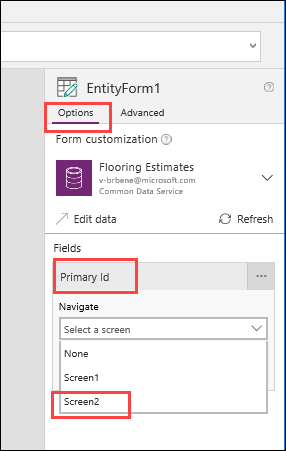

1. Click on the second screen, click the entity form, and then click the **Advanced** tab. Search for **Item**, and in the **Item** field, enter **NavigationContext**. 

    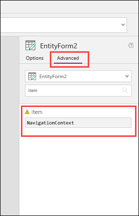

    This tells the form to load the data from the item that was previously clicked on the first screen.

1. Remaining on the second screen, click **Insert**, and then click **Button**. Drag the button to an empty space on the screen, and in the button's **OnSelect** field, enter **Navigate(Screen1, ScreenTransition.Fade)**. 

    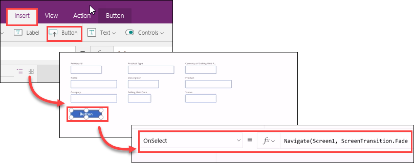

1. Click the play button and test the app. Although this is a simple app, it shows how quickly you can create a tablet view that shows all the information inside of the Flooring Estimates entity, provide a deeper look into the details, and navigate back and forth. 

## Create an app with the Common Data Service C# SDK

Pro developers can use the Common Data Service C# SDK to either increase the complexity of logic that is used in an app, or for building rich clients or SaaS and web applications. 

Apps that use the SDK must be registered with Azure Active Directory, so they can make requests and use the Common Data Service. We won’t build an SDK-based app in this topic, but we will look at a few of the patterns you can support with the SDK, including rich queries. The SDK is built on a LINQ-based syntax, and supports actions such as create, delete, insert, and update.  

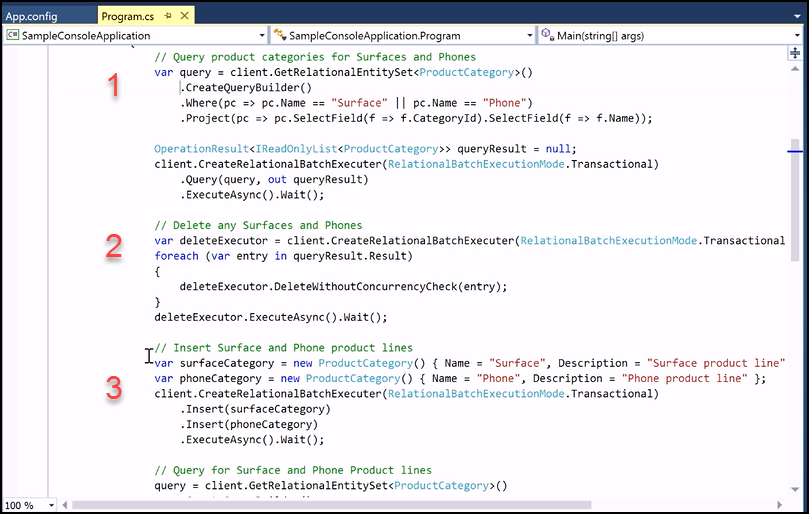
 
1. This is an example of how you can query the Common Data Service. In this case, the query looks for two product categories – **Surfaces** or **Phones**. In general, you’ll create a query builder, provide the **Where** clauses, (in this case where the name of the product category is either **Surface** or **Phone**), and get back the category ID and name for the product category.

2. This is a Delete action to clean up any existing cateogories.

3. In this procedure, you have an insert operation to insert new entries into the **Product Category** entity. Two categories are created and inserted - one for the **Surface**, and one for the **Phone**.  

The SDK works on batches - this is how PowerApps can optimize moving large amounts of data back and forth. Simply create the insert request for Surface, and the insert request for Phone, and then execute those requests. This is just the beginning of what you can do with the Common Data Service C# SDK, and in the coming months you’ll continue to see more and more features using the SDK from the PowerApps team.