<properties
   pageTitle="The Common Data Service: Creating an app | Microsoft PowerApps"
   description="Create a simple app using data from the Common Data Service"
   services=""
   suite="powerapps"
   documentationCenter="na"
   authors="v-brbene"
   manager="anneta"
   editor=""
   tags=""
   featuredVideoId="os33pHQ9jSU"
   courseDuration="6m"/>

<tags
   ms.service="powerapps"
   ms.devlang="na"
   ms.topic="get-started-article"
   ms.tgt_pltfrm="na"
   ms.workload="na"
   ms.date="08/03/2017"
   ms.author="v-brbene"/>

# Creating an application with the Common Data Service

The Common Data Service uses a **common data model**. The common data model stores what we call **entities**. What are entities? Entities can be thought of as **shared data**, which can be stored, retrieved, modified, and interacted with.  In this topic, you’ll learn more about entities and how to use them when you create an app. 

## Entities
There are two types of entities: **standard entities**, which are provided with the Common Data Service database, and **custom entities**, which you can create to meet your specific data needs.

To view the standard entities, open PowerApps, click **Common Data Service**, and then click **Entities**. Shown below are some of the standard entities that ship out of the box, and are available to use immediately.  

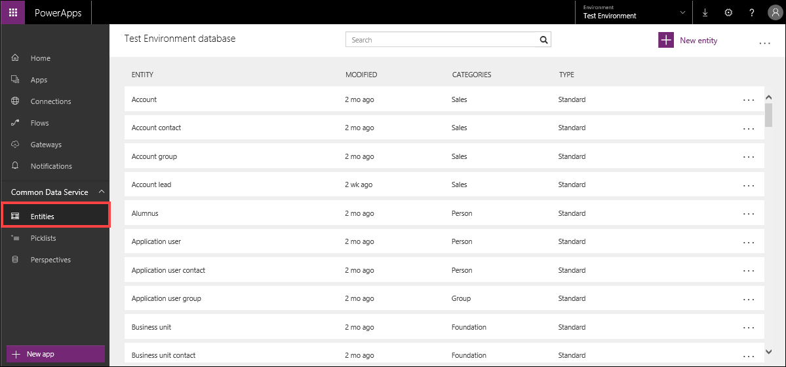

Entities are grouped by **categories** (like **Customer Service**), which are based on the functions that they serve. When you are building an app, you will often use entities from the same group. 

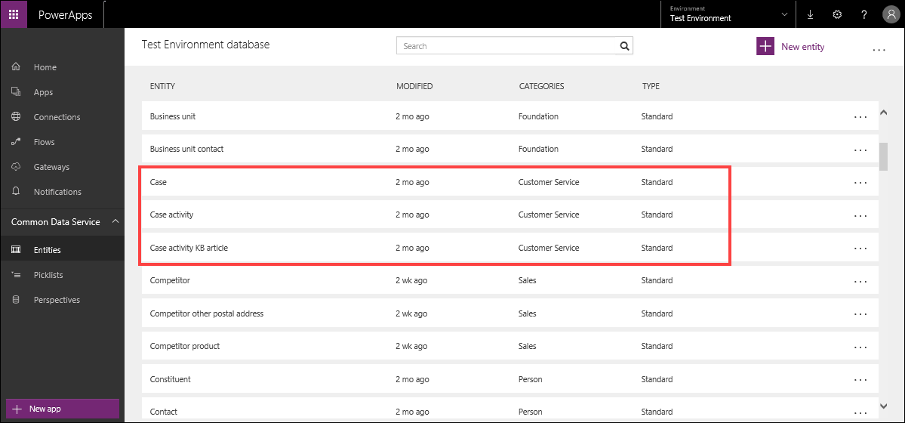

## Parts of an entity

Entities contain a set of default **Fields**, or attributes. For example, the **Product** entity has several fields, some of which are shown below. 

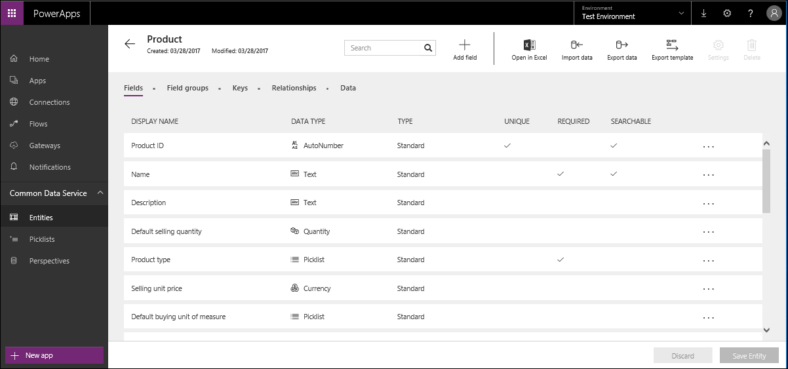

Fields are also grouped into **Field groups**, which control how data from the entity is displayed when you build an application.

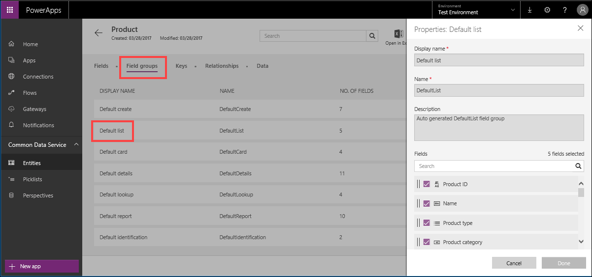

Entity **Keys** identify a unique row in an entity.

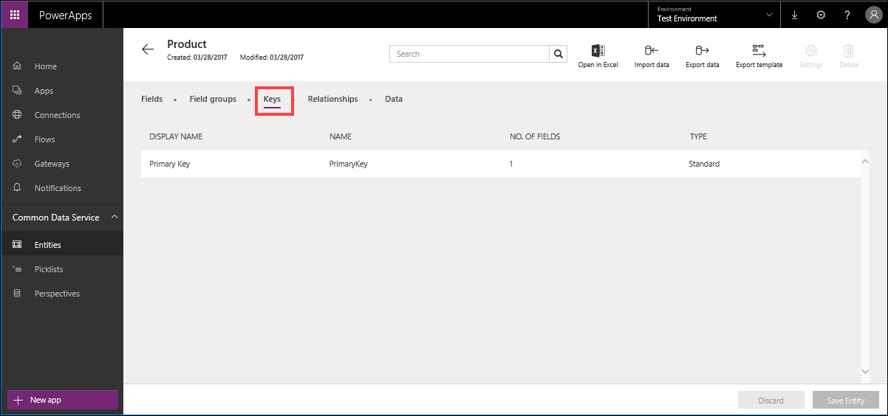

**Relationships** represent connections between related entities.

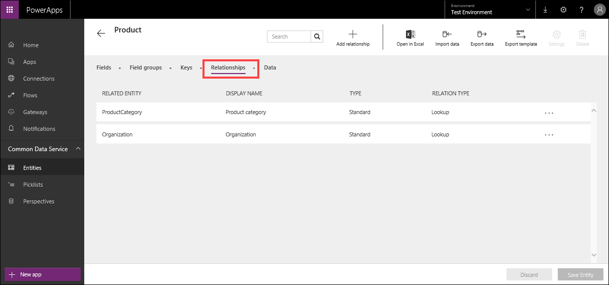

The **Data** tab displays the sample data provided with the database, or your own data if you have imported it. 

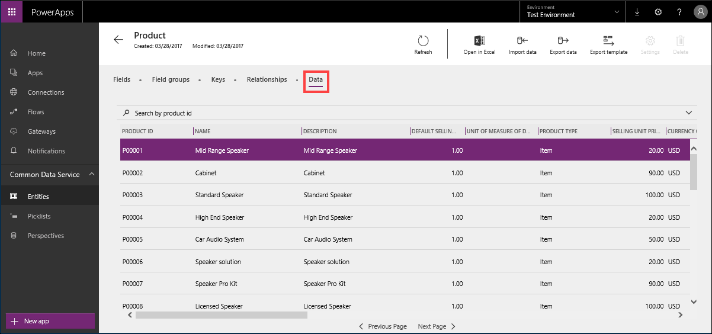

## Create an application 
You can easily create an app in PowerApps, based on one or more entities. In this example, we'll generate an app from the **Products** entity.

1. In PowerApps, click **New app**.

    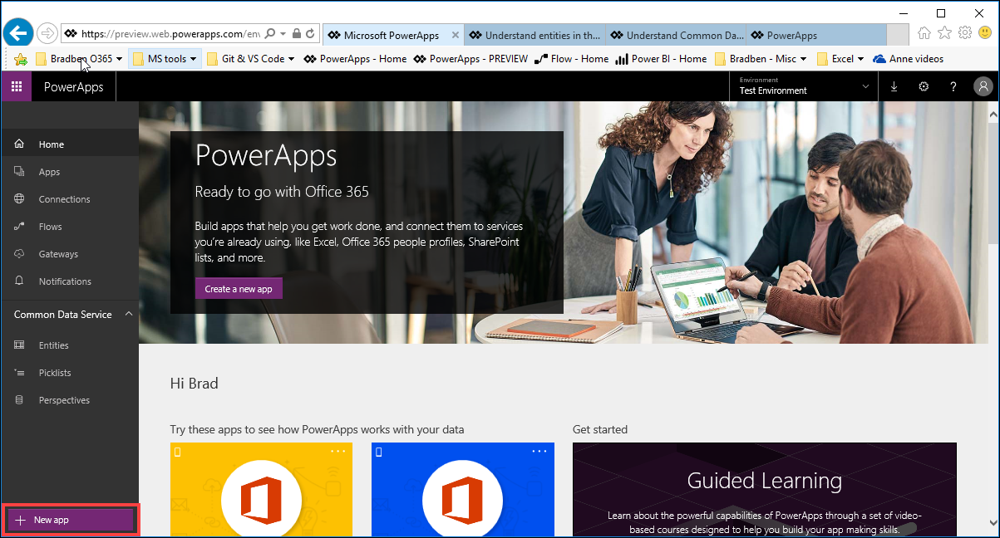

1. Click **Phone layout** for the **Common Data Service** app. 

    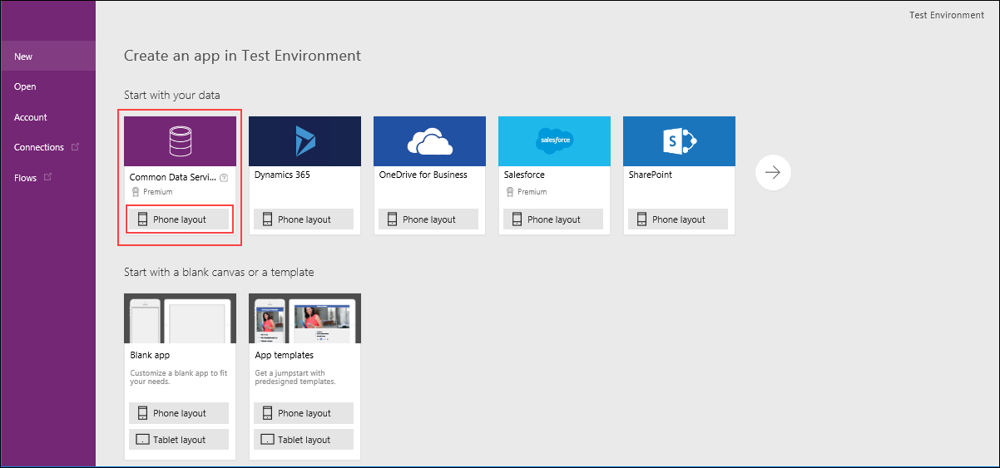

1. The Common Data Service connection is already selected.  In the right-hand pane, scroll down or search for **Products**, select it, and then click **Connect**.  

    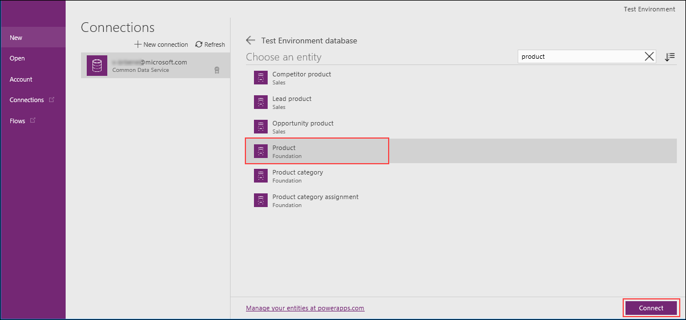

PowerApps builds the app and opens it in PowerApps Studio.  

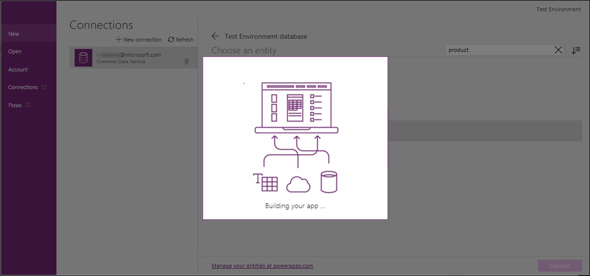

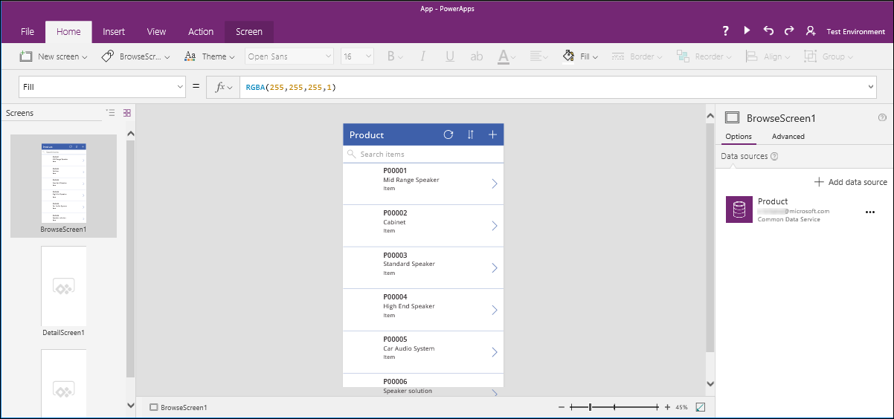

The application is automatically ready to use. You can save this application as-is without changing anything, and then share it to your users, who can access it on the web or on their mobile devices.

In the next topic, we'll look at how to create a custom entity. 

