<properties
   pageTitle="The Common Data Service: Create an Entity | Microsoft PowerApps"
   description="Create Custom Entities with the Common Data Service"
   services=""
   suite="powerapps"
   documentationCenter="na"
   authors="v-brbene"
   manager="anneta"
   editor=""
   tags=""
   featuredVideoId="os33pHQ9jSU"
   courseDuration="7m"/>

<tags
   ms.service="powerapps"
   ms.devlang="na"
   ms.topic="get-started-article"
   ms.tgt_pltfrm="na"
   ms.workload="na"
   ms.date="08/03/2017"
   ms.author="v-brbene"/>

# Custom Entities in the Common Data Service

In this topic, we’ll create a custom entity and use that to build an app that displays flooring options, such as carpet, tile, and hardwood. We’ll also use existing entities to create **relationships**, and explore how to use a **picklist**.

First, let’s look at the data in the **FlooringEstimates.xls** spreadsheet. 

- **Name** – A text field with the name of the product.
- **ProductID** – This text field is empty in the spreadsheet, but we’ll use **lookups** to pull in data from an existing entity. 
- **Category** – A text field with the category of the product.
- **Product Type** – A text field. 
- **Selling Unit Price** – A currency field in USD. 
- **Status** – This field will be formatted as a picklist.  

## Create a new entity

1. On the **PowerApps** page, expand **Common Data Service**, and click **Entities**. On the **Entities** page, click **New entity**. 

    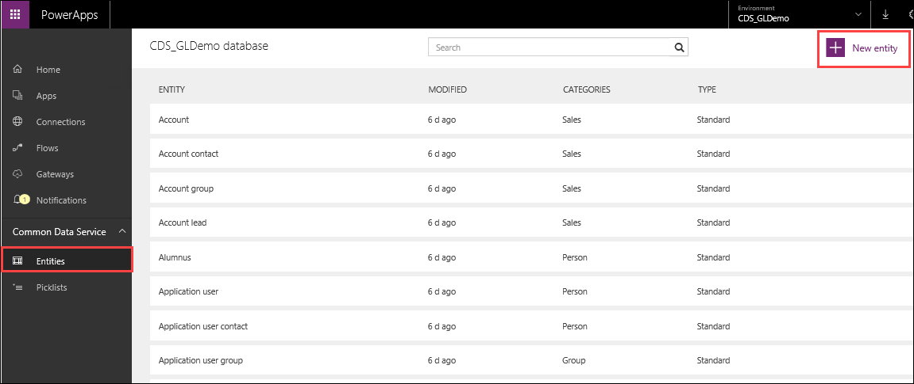

1. Add the following values and click **Next**. 
    - **Name** – FlooringEstimates
    - **Display Name** – Flooring Estimates
    - **Description** - This is an entity used to show various flooring options and estimates.

    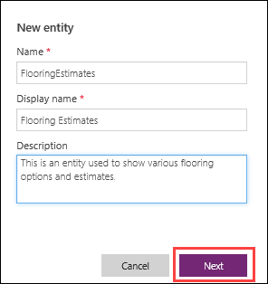

    PowerApps automatically creates a new entity with some default fields.

    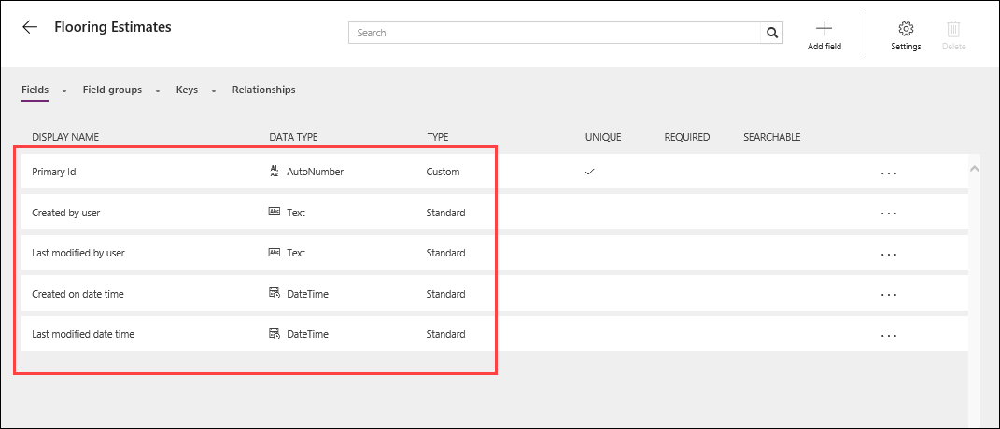

Next, we’ll create the fields we need to match the data in the spreadsheet.

## Add new fields to an entity

1. Click **Add field**, add the following values, and click **Add Field**.
 
    - **Display Name** – Name
    - **Name** – Name
    - **Type** – Text

    

1. Repeat the steps above to add the **Product Type** and **Category** fields.

    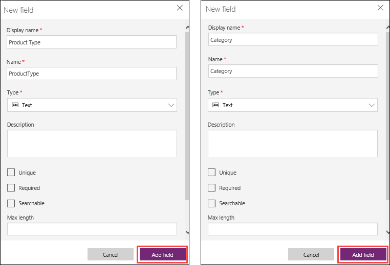

1. Repeat the steps again to add the **Description** and **Selling Unit Price** fields, but note the different values in the **Type** field. **Description** is **Multiline Text**, and **Selling Unit Price** is **Currency**. 
 
    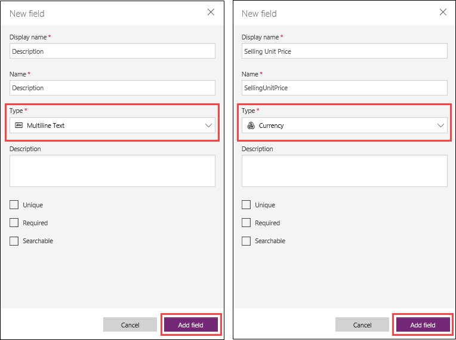

1. Click **Save Entity**. 

    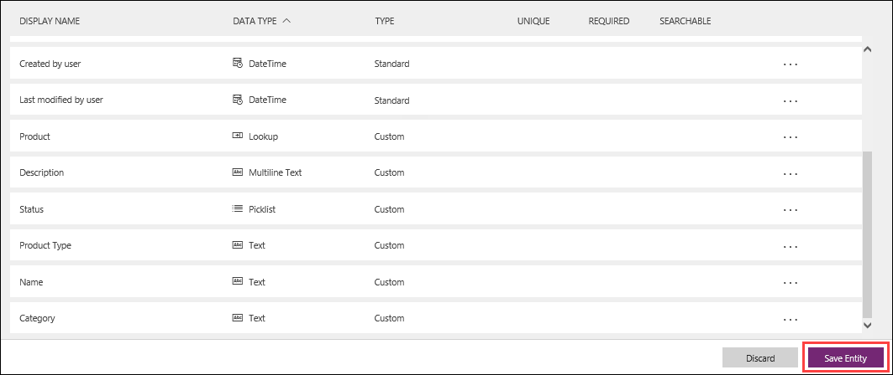

## Lookups and Picklists

To populate data into the **Product ID** field, we’ll leverage some sample data that is already in an existing entity, **Product**, by using a lookup.

1. Click **Relationships**, and then click **Add relationship**. 

    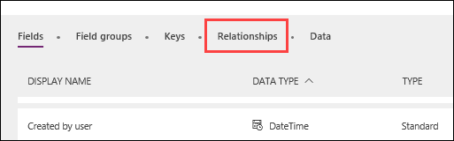

1. In **Related entity**, select **Product**. The remaining fields are filled in automatically and the **Relationship type** is set to **Lookup**. Click **Add relationship**. 

    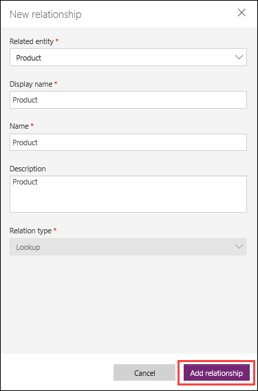

To create values for the **Status** field, we’ll use an existing picklist, also named **Status**. The picklist contains two values, **Active** and **Inactive**. 

1. Click **Fields**, and then click **Add field**. Add the following values and click **Add field**. 

    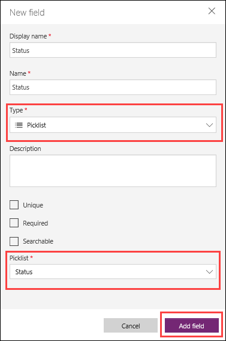

    Our custom entity **FlooringEstimates** now has all the fields that match the spreadsheet that we want to import.
    
1. Click **Save entity**.

## Import data into the entity

1. On the **FlooringEstimates** property page, click **Import data**.

    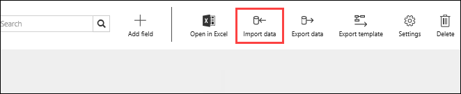

1. Search for **FlooringEstimates.xl**s and click **Open**. 

    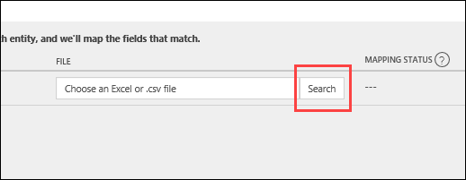

    PowerApps will try to map the fields in the spreadsheet to the fields created in the entity. In this case, the mapping status should display **Partial Match**.
    
1. Click **Show mapping**.

    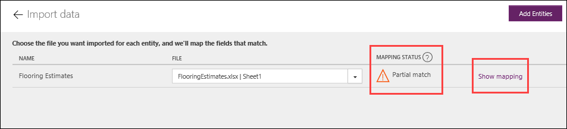

1. Notice that the only field that doesn’t match is **ProductID**. From the dropdown list for **ProductID**, select **PRODUCT_PRODUCTID**.  This is the relationship that was created between the **Product** entity and the **FlooringEstimates** entity.  Click **Save changes**.
   
    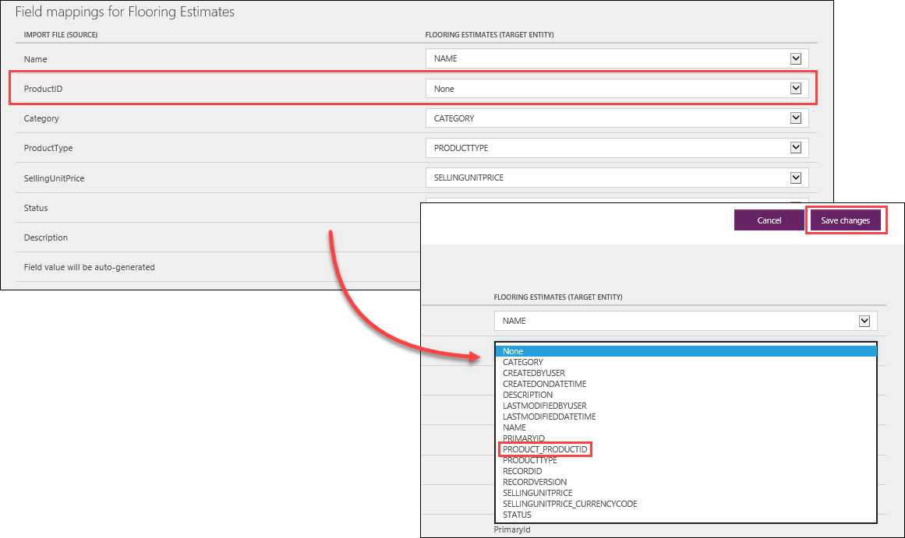

1. Verify that the status shows a match (green checkmark), then click **Import**. 
 
    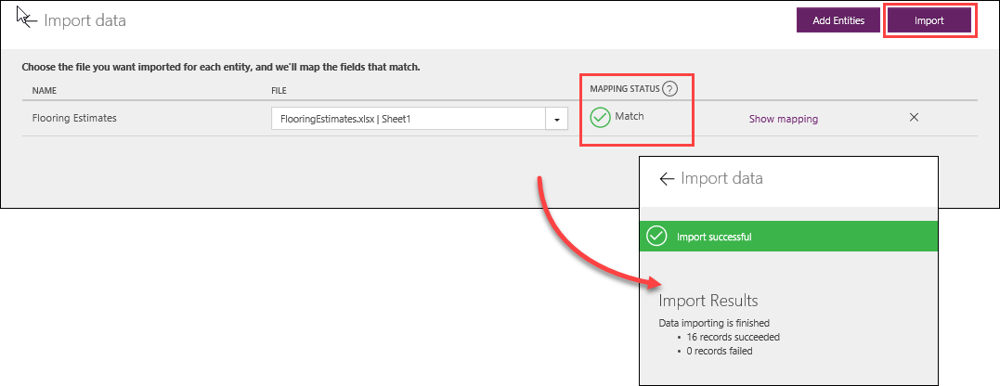

## Using a lookup to import data

1. Click the back arrow, and open the **FlooringEstimates** entity. Click **Open in Excel**, and when prompted to **Open** or **Save**, click **Open**. 

    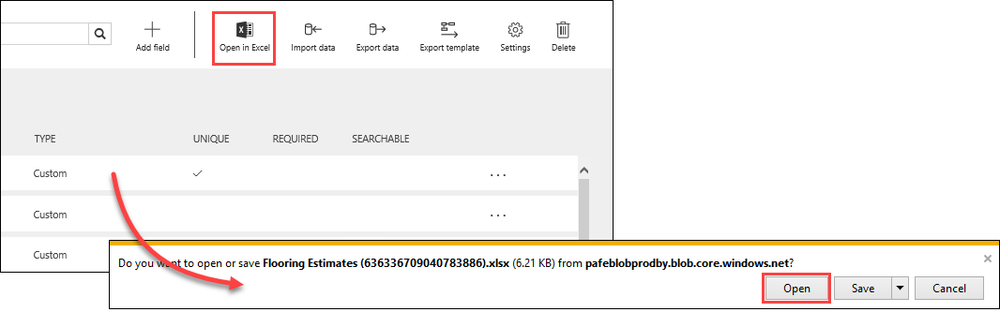

1. When Excel opens, click **Enable Editing**. If prompted, click **Trust this add-in**. 

    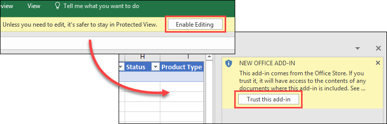

    Once you’re authenticated, it will take a minute to retrieve the metadata, and the spreadsheet will populate with the data. Notice the **Product** field is empty. 

    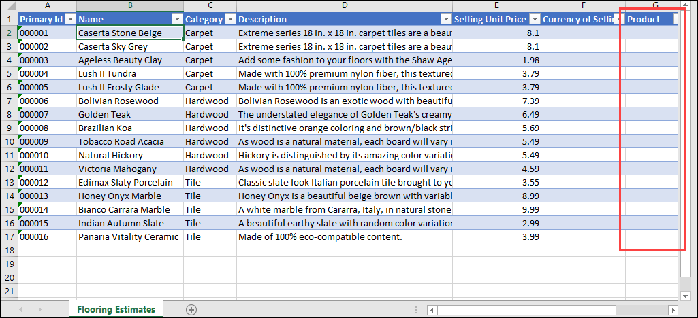

1. Click the first cell in the **Product** column, and the **Product** entity data will load and display a lookup table on the right. 

    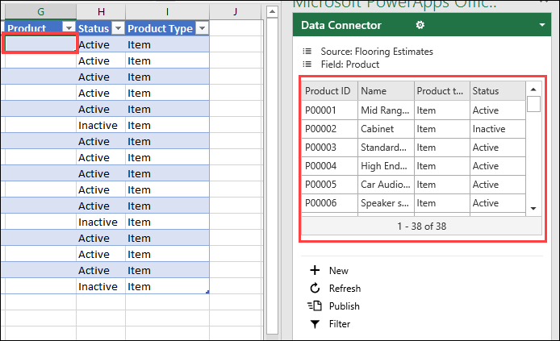

    **Note:** The sample data from the **Product** entity is not related to flooring, but we're just illustrating the power of defining and using relationships in the Common Data Service.

1. Click the first cell in the lookup table, **P00001**, and it will automatically populate the selected cell in the **Product** column on the left. 

    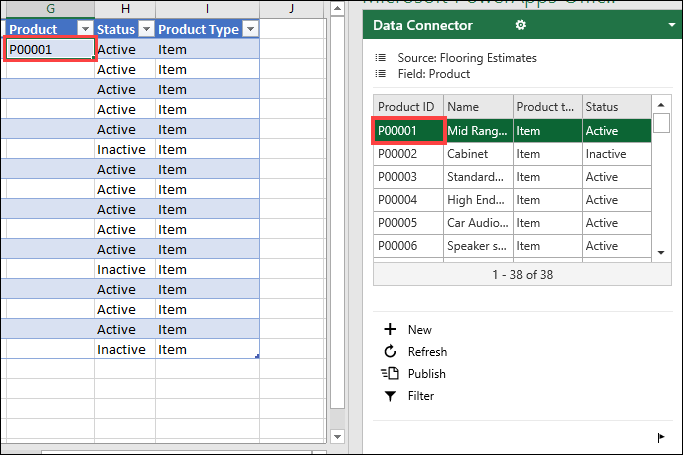

1. Click the second cell in the **Product** column, and then select the second cell, **P00002**, in the lookup table.  Continue to populate the **Product** column this way for the remaining records. 

    

1. When you update a spreadsheet with this method, you must publish the changes to write them back to the Common Data Service. In the same right-hand dialog, click **Publish**. 

    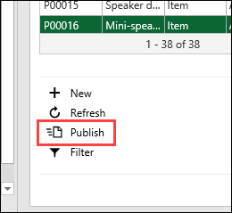

1. Then, close the spreadsheet by clicking the **X** in the upper right corner and **Save** the changes. Now you have a local copy in case you need it.

    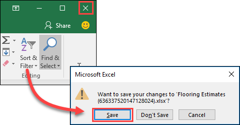

1. On the **FlooringEstimates** property page, click **Data**. When the updated data displays, scroll to the right and verify that both the **Product** and **Status** fields have been updated.

    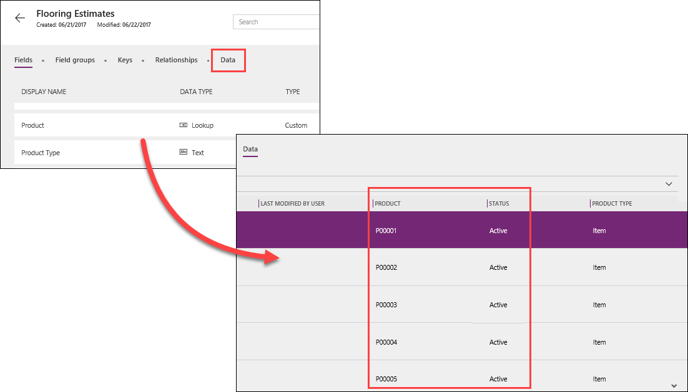

## Build the app

1. In the left pane, click **New app**, click **Phone layout** for the Common Data Service, select the **Flooring Estimates** entity, and then click **Connect**. 

    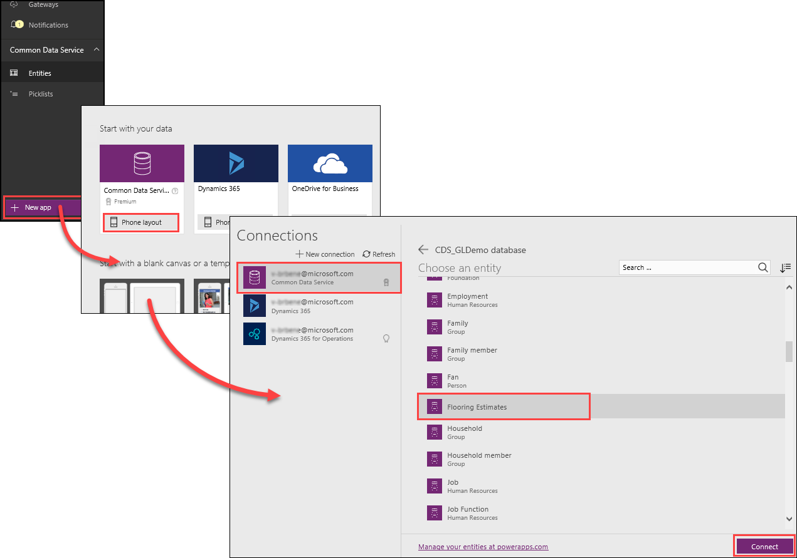

1. After PowerApps builds the app, click **Play**, and walk through the features of the app. You can search for items, view details of an item, or even add a new item. 

    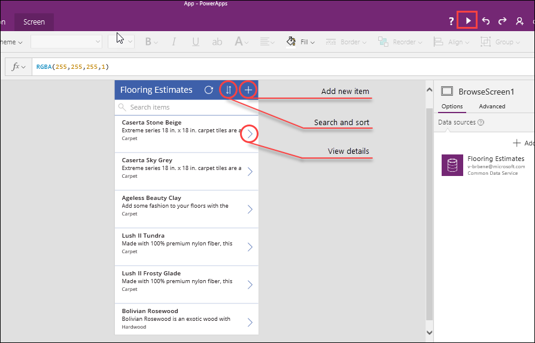

    **Note:** Your app might show different fields from the **Flooring Estimates** entity. You can change the fields on the **Data** tab in the right pane.

Next, we’ll look at managing security in the Common Data Service. 

