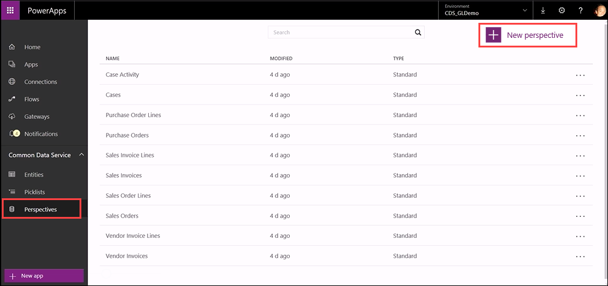
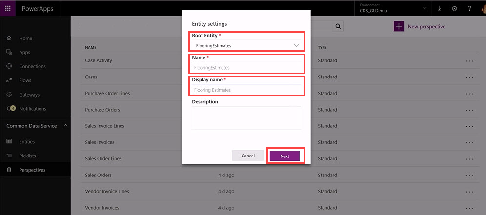
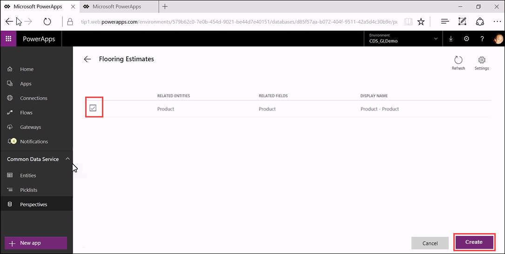
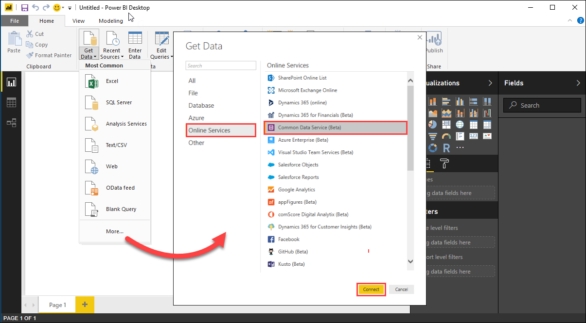
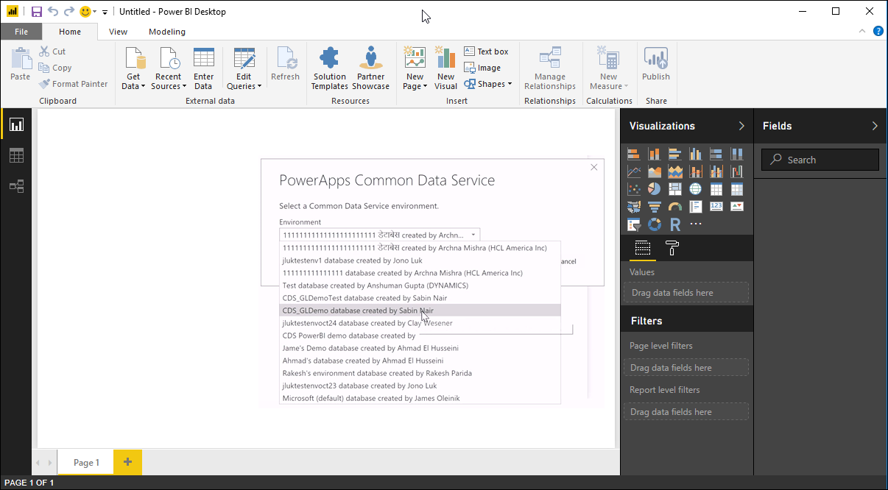
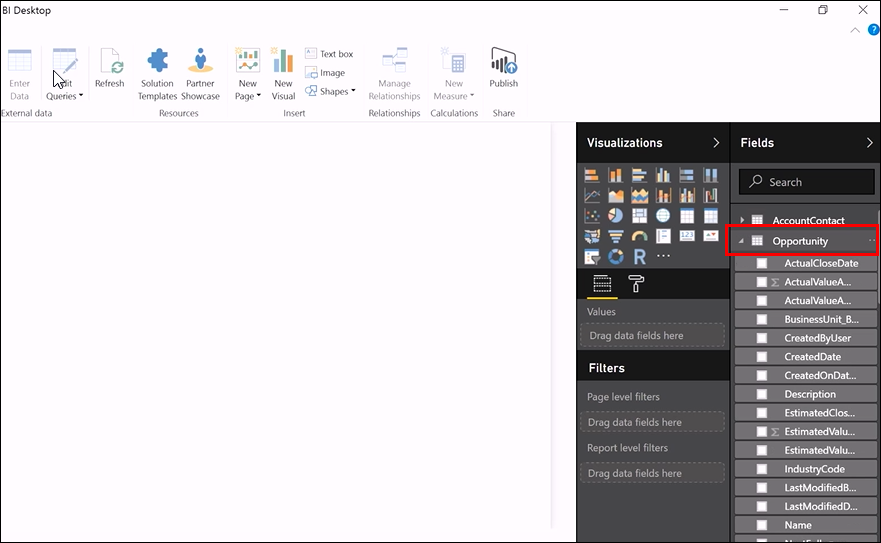
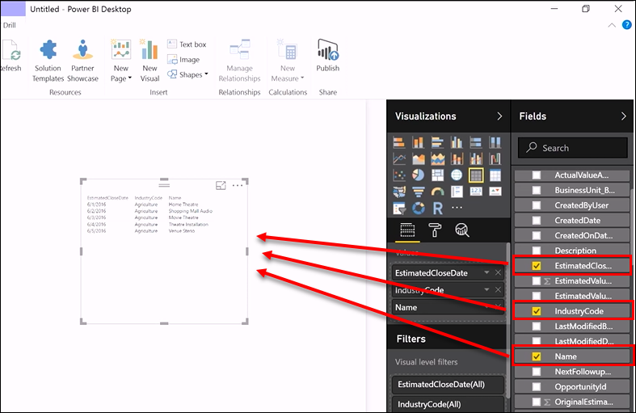

<properties
   pageTitle="Integrating PowerBI with the Common Data Service | Microsoft PowerApps"
   description="How to use perspectives to create PowerBI reports"
   services=""
   suite="powerapps"
   documentationCenter="na"
   authors="v-brbene"
   manager="anneta"
   editor=""
   tags=""
   featuredVideoId="os33pHQ9jSU"
   courseDuration="5m"/>

<tags
   ms.service="powerapps"
   ms.devlang="na"
   ms.topic="get-started-article"
   ms.tgt_pltfrm="na"
   ms.workload="na"
   ms.date="6/9/2017"
   ms.author="v-brbene"/>

# Integrating Other Services
As we saw earlier, one of the major benefits of building with the Common Data Service is that we do all the work in the background to connect the rest of Microsoft’s applications and services with any of the data that you have in the Common Data Service.  The PowerBI Service is a great example of how this works.

The PowerBI Service talks to the Common Data Service via **Perspectives**. Perspectives are groupings of entities, and their related entities, that make sense for building reports.  The following image shows the set of standard perspectives that we provide out of the box. You can also create your own custom Perspectives, which we’ll do next. 

# Create a New Perspective
To create a new Perspective, open **PowerApps**, and in the left navigation pane, under **Common Data Service**, click **Perspectives**.  In the upper right-hand corner of the Perspectives page, click **New Perspective**. 

In both the **Root Entity** and **Name** fields, enter **FlooringEstimates**, and in **Display Name**, enter **Flooring Estimates**. Click **Next** to create the new Perspective.

When a new Perspective is created, PowerApps discovers the relationships and displays the related entities and related fields, which you can select or deselect. For this example, leave **Products** selected and click **Create**. 

The **Flooring Estimates** perspective now shows up with the other standard perspectives that come with PowerApps. 

# Configure PowerBI

Next, open the **PowerBI Desktop** client. Click **Get Dat**a, then click **More…**, and then click **Online Services**. Select **Common Data Service**, and then click **Connect**.
  

Select your Common Data Service environment, and click **OK**. 

On the **Navigator** page, expand your test environment, select the **SalesOrders** perspective, and click **OK**.  

In the PowerBI Desktop client, in the **Fields** column on the right-hand side, expand **Opportunity**. 

Drag the **EstimatedClosing**, **IndustryCode**, and **Name** fields to the desktop area to build the report.

This feature is currently in preview. Please let us know if you have any feedback, and check back often because we add content over time. PowerBI is the first of many experiences that we expect to share over the coming months to demonstrate how the Common Data Service can help you build your apps quickly and effectively. 