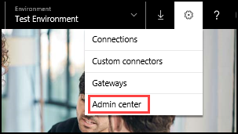
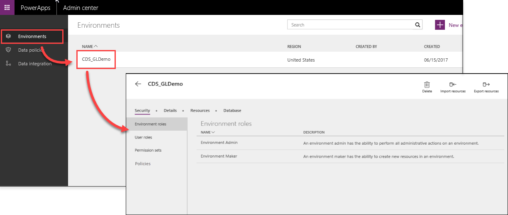
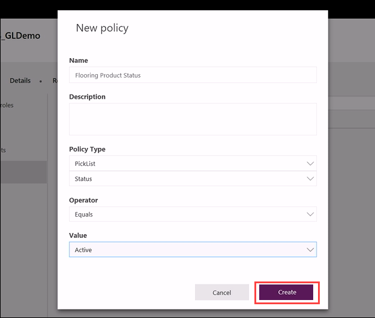
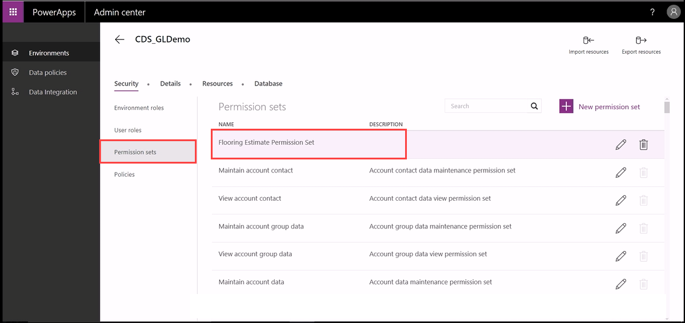
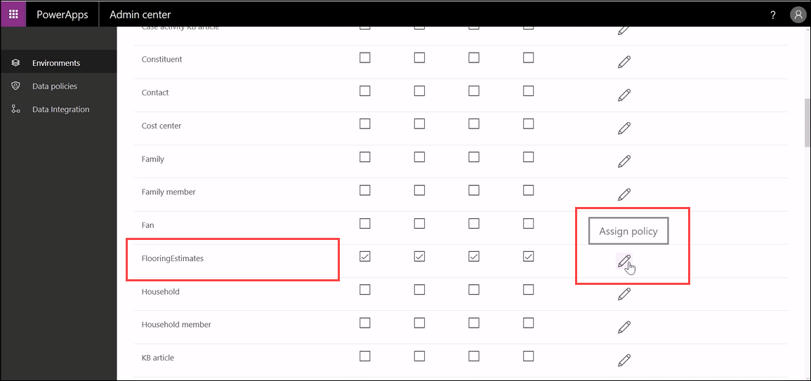
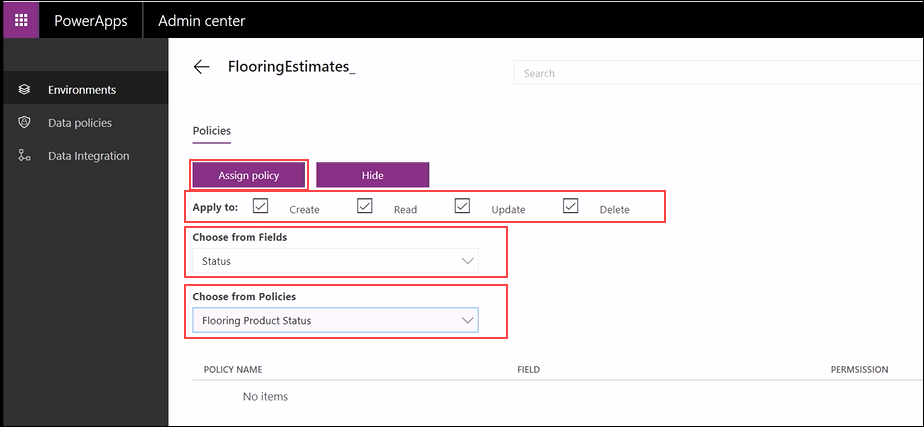
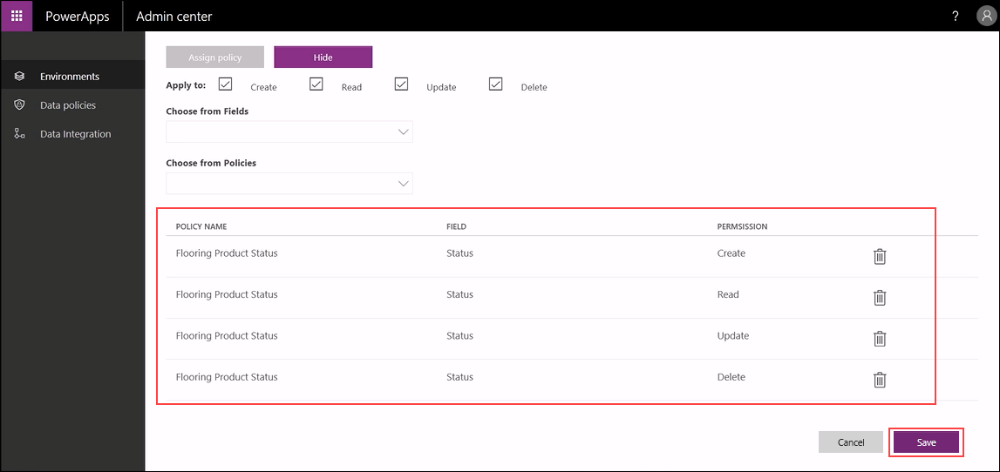
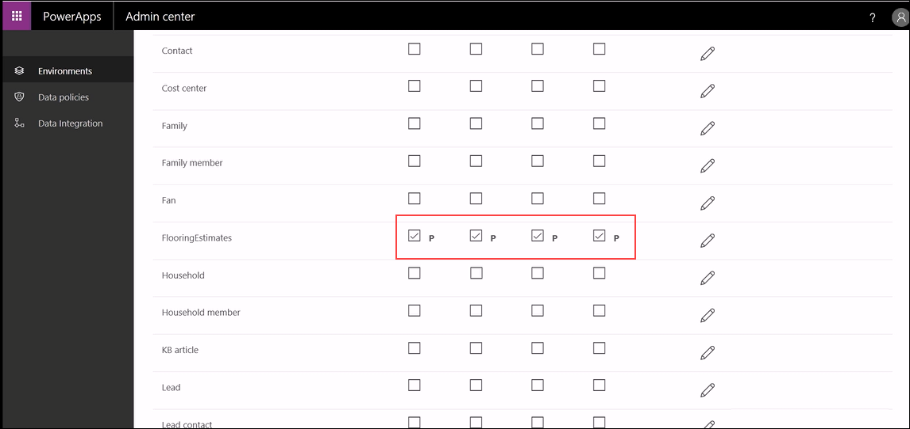

<properties
   pageTitle="The Common Data Service: Managing RLS | Microsoft PowerApps"
   description="Managing Record Level Security the Common Data Service"
   services=""
   suite="powerapps"
   documentationCenter="na"
   authors="v-brbene"
   manager="anneta"
   editor=""
   tags=""
   featuredVideoId="os33pHQ9jSU"
   courseDuration="3m"/>

<tags
   ms.service="powerapps"
   ms.devlang="na"
   ms.topic="get-started-article"
   ms.tgt_pltfrm="na"
   ms.workload="na"
   ms.date="08/03/2017"
   ms.author="v-brbene"/>

# Record level security

In this topic, we introduce you to the **Record Level Security** (RLS) feature of the Common Data Service. RLS complements the environment, database, and entity level security that the Common Data Service provides. It allows administrators to define policies that determine what records in an entity the user can see. RLS is important for many customers that want to define the subset of records that users can see in their database. As an example, sellers of products should only see products that are active, and not products that are inactive. The first RLS policies that the Common Data Service supports are based on ownership and picklist. 

## Create a new policy 

**Policies** are added to a permission set and specify the **Create**, **Read**, **Update**, and **Delete** permission levels allowed on an entity. In these steps, you will create a policy for the flooring estimates **Status** field.

1. In PowerApps, click the settings icon and click **Admin center**. 

    

1. In the **Admin center**, click **Environments**, and then select your environment.

    

1. Click **Policies**, and then click **New Policy**. 

    

1. Fill out the fields as shown below, and then click **Create**.
    - **Name**: "Flooring Product Status"
    - **Policy Type**: "Picklist", "Status"
    - **Operator**: "Equals"
    - **Value**: "Active"

    

    Next, we’ll associate the new policy with the permission set that we created in the previous topic. 

## Associate the policy with a permission set

1. Click **Permission sets**, then click **Flooring Estimate Permission Set** to edit it.

    

1. Scroll down to the **FlooringEstimates** entity, and click on the edit icon to assign a policy.

    

1. Complete the form as follows, then click **Assign**:
    
    - In **Apply to**, select all four checkboxes. 
    - In **Choose from Fields**, select **Status**.
    - In **Choose from Policies**, select **Flooring Product Status**. 

    

    The permissions that you just added are displayed on the policy property page. 
    
1. Click **Save**.

    

1. Click the back arrow and scroll down to the **FlooringEstimates** entity. Each of the permission levels are now annotated with the letter **P**, indicating that a policy has been associated with that permission. 

    

Currently, PowerApps supports policies for owner and picklist. In the future, we will offer support for hierarchies, business units, and other more complex business concepts.

In our next topic, we’ll talk about integrating data into the Common Data Service.

