<properties
   pageTitle="The Common Data Service: Managing security | Microsoft PowerApps"
   description="Managing security in the Common Data Service"
   services=""
   suite="powerapps"
   documentationCenter="na"
   authors="v-brbene"
   manager="anneta"
   editor=""
   tags=""
   featuredVideoId="os33pHQ9jSU"
   courseDuration="4m"/>

<tags
   ms.service="powerapps"
   ms.devlang="na"
   ms.topic="get-started-article"
   ms.tgt_pltfrm="na"
   ms.workload="na"
   ms.date="06/16/2017"
   ms.author="v-brbene"/>

# Managing security in the Common Data Service

In this video, we look at how to manage security in the Common Data Service. We all know it's critical to help customers secure the data that they need, in the way that they want. And from day one, we've supported this. We'll start at the top, and talk about the different ways that administrators can secure their data, starting with the environment, then securing the database, and finally, securing individual entities. 

## Environment roles

In PowerApps, click the settings icon and then click **Admin center**. 

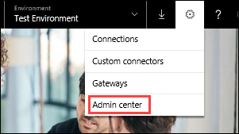

In the **Admin center**, click **Environments**, and then select your environment.

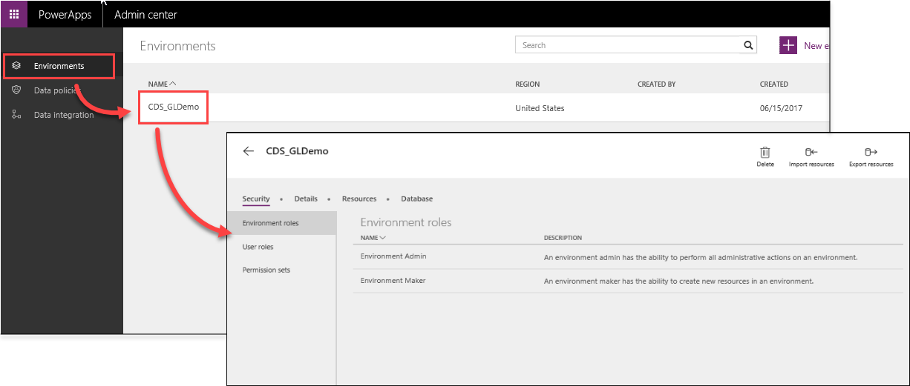
 

We’ll start by looking at the environment roles. There are two environment roles created automatically in each environment. 

The first role is the **Environment Admin**. This role gives users all the permissions they need to perform administrative actions on an environment, including:

- Adding or removing a user or group from either the Environment Admin or Environment Maker role.
- Provisioning a Common Data Service database for the environment.
- Viewing and managing all resources created within an environment.
- Setting data loss prevention policies. 

The second environment role is the **Environment Maker**. This role allows the user to:

- Create resources within an environment, including apps, connections, custom connectors, gateways, and flows using Microsoft Flow. 
- Distribute the apps that they build within an environment to other users and security groups in the organization. 

## Database modes

A database in PowerApps can be in one of two modes: **Open** or **Restricted**. Click **Database**.

- **Open** - Can be accessed by anyone in the tenant without any authorization. 
- **Restricted** - Requires that security is evaluated so that individual users only see the data that they need.

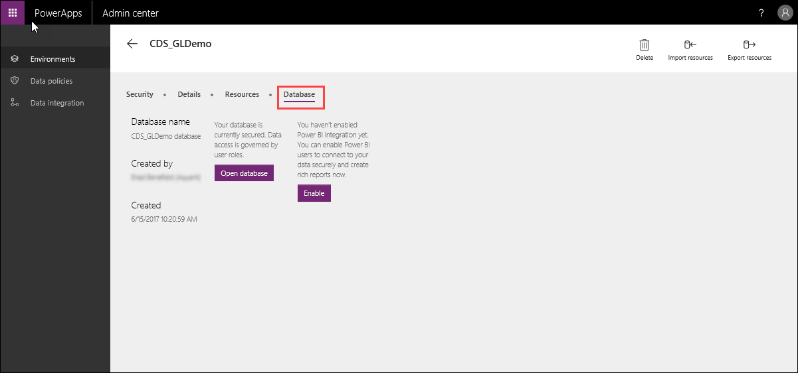

## User roles in the database

The entire Common Data Service security model is based around **roles**.  There are two user database roles that are created automatically in each database. Click **Security**, and then click **User roles**.

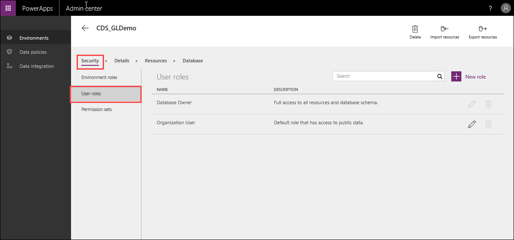

- **Database Owner** - This role lets users access and perform any administrative actions on the database.
- **Organization User** - This role gives users access to the database only if they are using applications that are stored there. If you share a PowerApp application with users, those users are also added to the **Organization User** role.

## Creating a role and assigning users

In earlier sessions, we created an app to manage flooring estimates. Now, we’re going to create a role that lets users see active flooring estimates. First, we’ll create a new role, then we’ll create a new permission set, and then we’ll link the permission set to the role. 

Open the PowerApps Admin center, click **Environments**, and then click on your environment. Click **User Roles**, and then click **New Role**. 

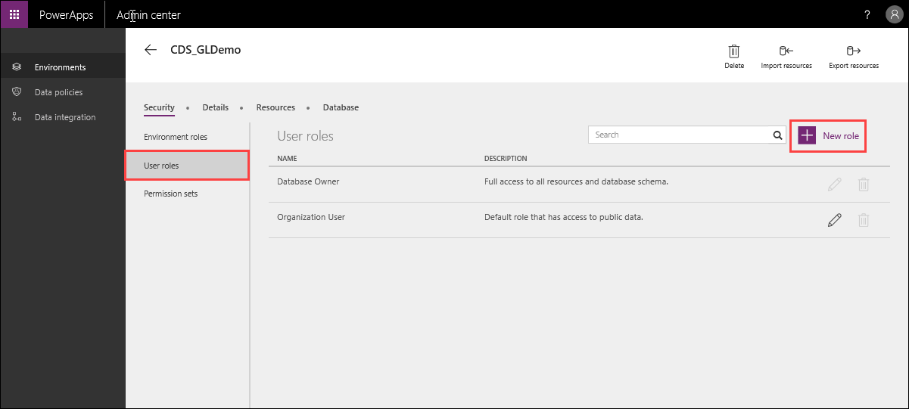 

In **Name**, enter **Flooring Estimates – Active**, in **Description**, enter **Access to view active flooring estimates**, and then click **Create**. 

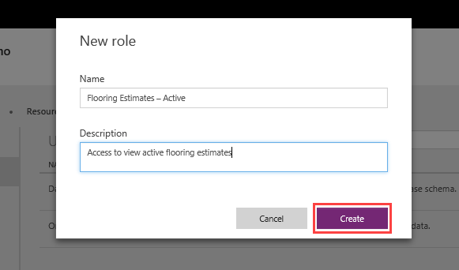 

In the list of user roles, click the new role you just created, and then click **Users**. 

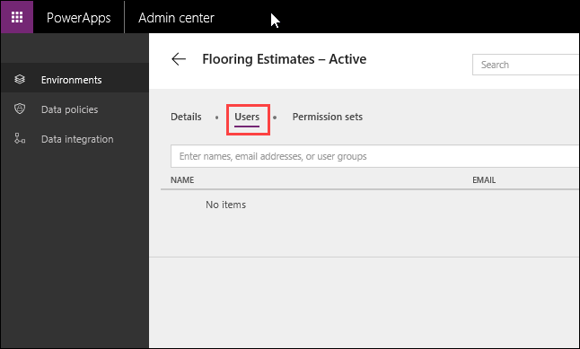

In order for users to be granted the permissions of the role, they must be specifically added to the role. You can add users from your company directory, or by email, or you can add user groups. For this session, search for your own account, select it, and click **Save**.

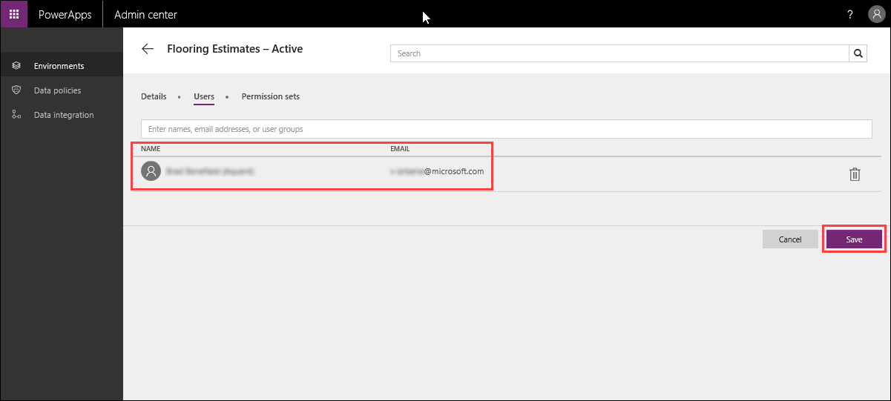 

Next, we’ll create a **permission set**. A permission set defines what level of permissions a user has on specific entities. Click the back arrow to return to the **User Roles** page, click **Permission sets**, and then click **New Permission set**.

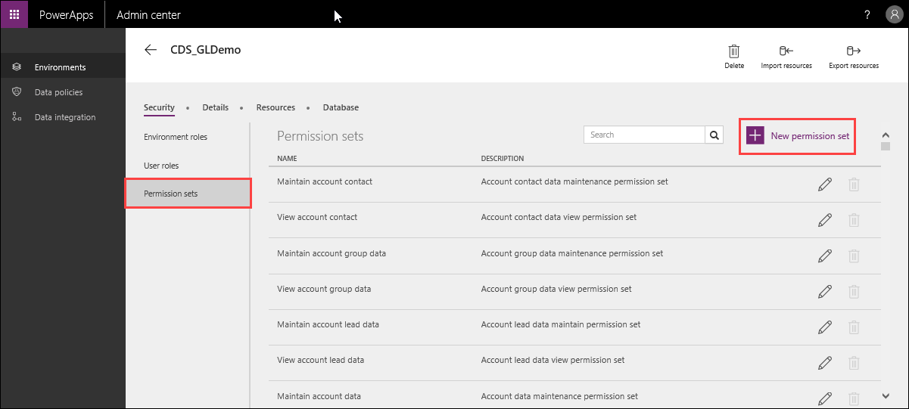

In **Name**, enter **Flooring Estimate Permission Set**, in **Description**, enter **Allows access to the FlooringEstitmate entity**, and then click **Create**.  

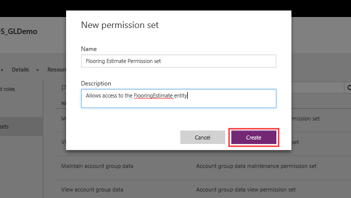 

In the list of permission sets, click **Flooring Estimate Permission Set**. 

Scroll down to the **FlooringEstimates** entity that you created in the previous video, select the **Create**, **Read**, **Update**, and **Delete** permissions, and click **Save**. 

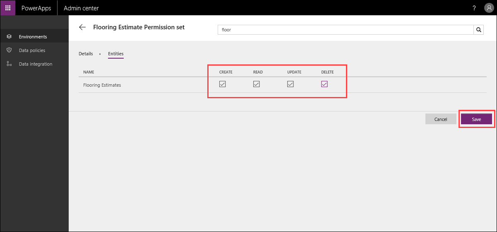

Next, we’ll add this permission set to the user role. Because you also added your account to the user role, this will let you have Create, Read, Update, and Delete permissions against the **FlooringEstimate** entity. 

Click the back arrow to return to your environment page. Click **User roles**, then click **FlooringEstimates Active**, and then click **Permissions Sets**.

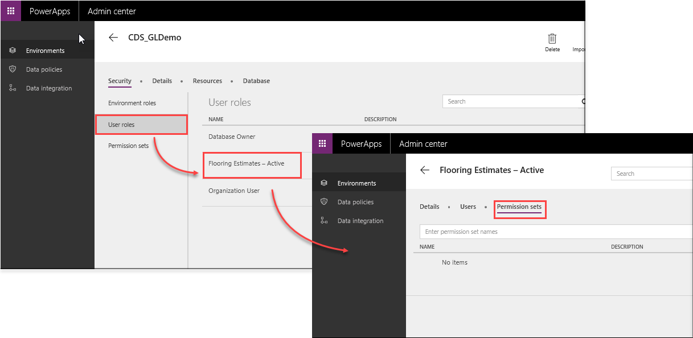 

Search for **Flooring Estimate Permission Set**, select it, and click **Save**. 

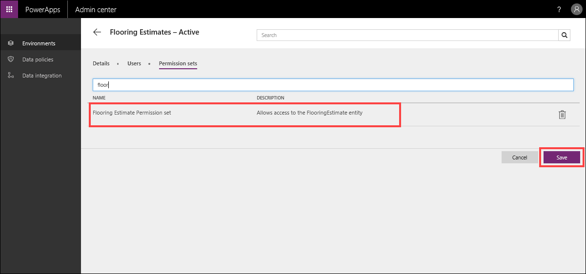 

Now, access permissions to the **FlooringEstimates** entity can easily be managed by adding or removing users from the **Flooring Estimates – Active** user role. If you need to modify the permission levels - for example, you don't want users to be able to delete data from the entity - uncheck the related checkbox in **Flooring Estimate Permission Set** and it will affect all users in the user role.

In our next video, we’ll talk about managing **Record Level Security** in the Common Data Service. 

