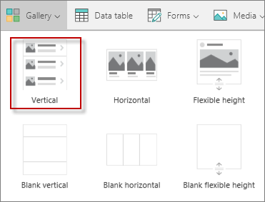

<properties
   pageTitle="Create an app using an Excel data source | Microsoft PowerApps"
   description="Create an app using an Excel data source"
   services=""
   suite="powerapps"
   documentationCenter="na"
   authors="v-subohe"
   manager="anneta"
   editor=""
   tags=""
   featuredVideoId=
   courseDuration=/>

<tags
   ms.service="powerapps"
   ms.devlang="na"
   ms.topic="get-started-article"
   ms.tgt_pltfrm="na"
   ms.workload="na"
   ms.date="06/29/2017"
   ms.author="v-subohe"/>

# Using an Excel data source
In this section, we'll build an app for the sales associates of Contoso Flooring company. The app will help the sales associates show customers how the installation process works. Several videos detailing the installation process have been recorded, and now we want to use the videos to help the sales force. In the previous video, we prepared the Excel data that we'll use to build the app. At part of building the app, we'll embed the Excel data in the app.

## Create an app using a data source from Excel ##
1. In PowerApps Desktop, click or tap **New** on the **File** menu (near the left-hand edge).

  

2. On the **Blank app** tile, click or tap **Phone layout**.

  

3. In the right-hand pane, click or tap **Add data source** and then click or tap **Add static data to your app**.

4. Browse to the Excel spreadsheet. In the example, the spreadsheet is called **YouTubeVideosFinal.xls**.

  The table called **Videos** (that we defined in the Excel spreadsheet) appears in the right-hand pane. Click or tap **Videos** to select it.

5. At the lower edge of the right-hand pane, click or tap **Connect**. **Videos** appears as a new data source in the right-hand pane.

## Add a graphic to the top of the app ##
1. On the **View** tab, click or tap **Media** and then click or tap **Images**.

2. Click **Browse** to find the image to add and open it. In the example, the image is called **guyontrain**.

3. Go back to the app.

## Insert the controls for the app ##
1. On the **Insert** tab, click or tap **Media**, and then click or tap **Image**.

  

  A field for the image appears at the top of the app.

2. Go to **Image** in the property list, and in the formula bar, replace **SampleImage** with **guyontrain**. The image we added earlier appears at the top of the app.

3. Resize the image so that it's appropriately placed at the top of the app.

4. On the **Insert** tab, click or tap **Gallery** and then click or tap **Vertical**. This gallery will be for the videos.

  

5. For the new gallery, go to **Items** in the property list and then replace **TextualGallerySample** with **Videos** in the formula bar. This enables all of the content from **Videos** to appear in the gallery.

6. In the gallery, remove the field with the URLs.

7. Click or tap the text field to select it. Go to **Text** in the property list and change it to **AutoHeight**. In the formula bar next to **AutoHeight**, type **true**.

8. For the text field, on the **Home** tab, center the text, make the text bold, and make the font size larger.

9. Click or tap the language field to select it (in the example, the field's title is **English**). For the **Text** property in the property list, replace **ThisItem.ULLanguage** with **"Language: " & ThisItem.ULLanguage** in the formula bar. This adds a label to the field.

10. Copy the **Language** field and paste it on the right-hand side of the app. For the **Text** property in the property list, type the following in the formula bar:
**Length in Minutes.Seconds: " & ThisItem.Length**.

11. Increase the size of the gallery template by dragging the lower edge down. Using the **Ctrl key**, click or tap all three fields (title, language, and length) and move them to the bottom. Now there's more space at the top for the videos.

## Add the videos ##
1. On the **Insert** tab, click or tap **Media**, and then click or tap **Video**.

2. Go to **Media** in the property list, and in the formula bar, type **ThisItem.VideoURL**.

Preview the app to see how it works. Users can scroll through the list of videos to find the video they're looking for.
