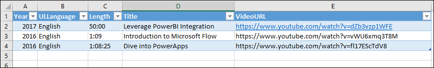
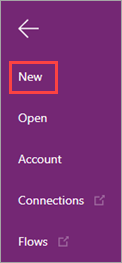
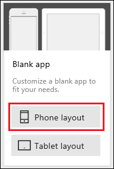
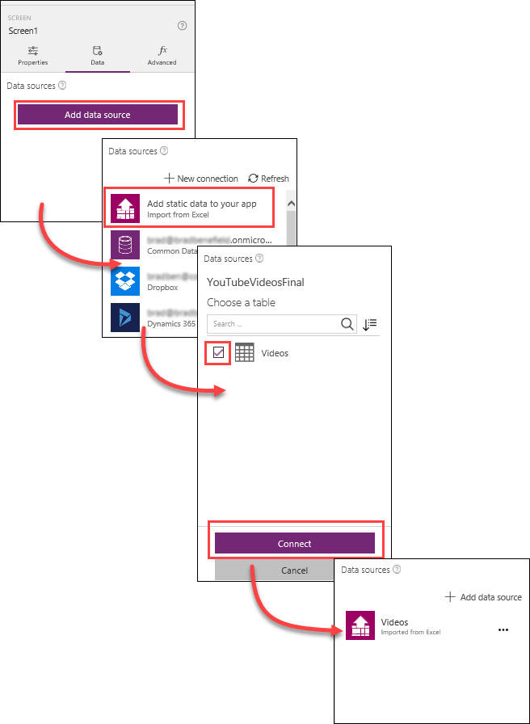
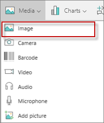
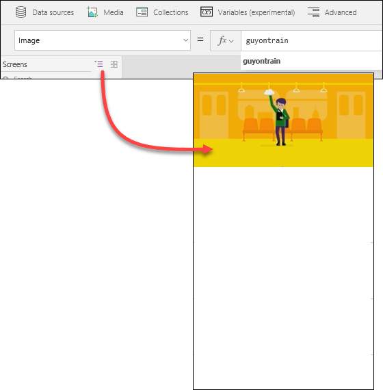
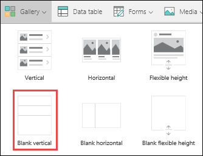
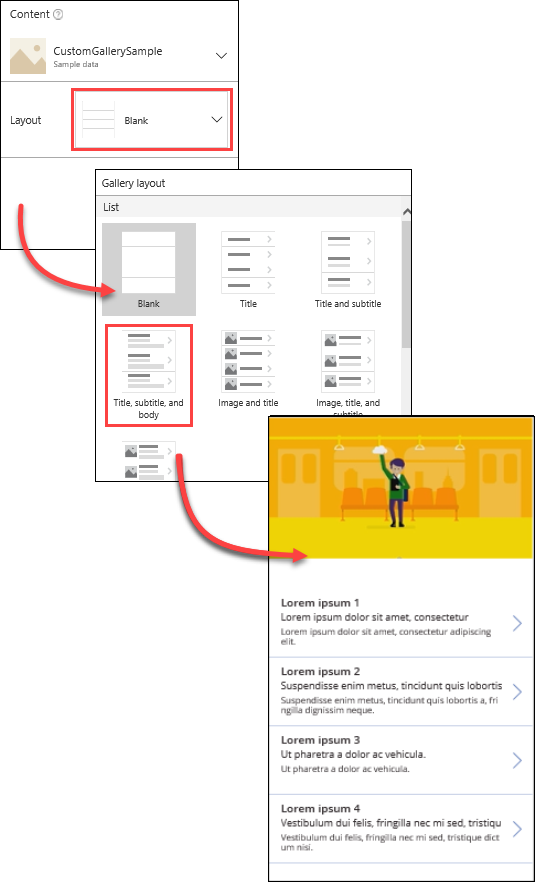
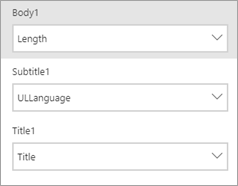
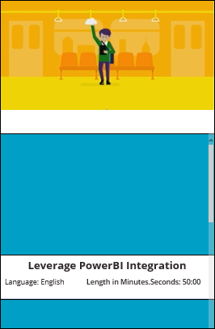

<properties
   pageTitle="Create an app using an Excel data source | Microsoft PowerApps"
   description="Create an app using an Excel data source"
   services=""
   suite="powerapps"
   documentationCenter="na"
   authors="v-subohe"
   manager="anneta"
   editor=""
   tags=""
   featuredVideoId=""
   courseDuration=""/>

<tags
   ms.service="powerapps"
   ms.devlang="na"
   ms.topic="get-started-article"
   ms.tgt_pltfrm="na"
   ms.workload="na"
   ms.date="08/07/2017"
   ms.author="v-subohe"/>

# Using an Excel data source
In this topic, we'll build an app for the sales associates of Contoso Flooring company. The app will let the sales associates show customers different videos on how the installation process works.

You can either download and use the example data source, **YouTubeVideosFinal.xls**, or create your own data source in Excel. Use the column names from the following example, and add a few sample rows with some YouTube links. Be sure to select the header row and the all the data rows, and then format the selection as a table named **Videos** before saving and closing your Excel file. 

## Create an app using a data source from Excel ##
1. In PowerApps Studio, click or tap **New** on the **File** menu.

   

1. On the **Blank app** tile, click or tap **Phone layout**.

   

1. In the right-hand pane, click or tap **Data**, then click or tap **Add data source**, and then click or tap **Add static data to your app**.

1. Browse to the Excel spreadsheet. In the example, the spreadsheet is called **YouTubeVideosFinal.xls**.

1. The table called **Videos** appears in the right-hand pane. Click or tap **Videos** to select it.

1. At the lower edge of the right-hand pane, click or tap **Connect**. **Videos** appears as a new data source in the right-hand pane.

   

## Add an image to the media collection
1. On the **View** tab, click or tap **Media** and then click or tap **Images**.

1. Click **Browse** to find an image to add and open it. In the example, the image is called **guyontrain**.

1. Go back to the app.

## Insert the controls for the app 
1. On the **Insert** tab, click or tap **Media**, and then click or tap **Image**.  A field for the image appears at the top of the app.

   
 

1. Select **Image** in the property list, and in the formula bar, replace **SampleImage** with **guyontrain**. The image we added earlier appears at the top of the app. Resize the image so that it fits at the top of the app.

   

1. On the **Insert** tab, click or tap **Gallery** and then click or tap **Blank vertical**. This will be the gallery for the videos.

   

1. Drag the gallery to the lower half of the form, and in the right-hand pane, select **Data**, and click the drop-down for **Layout**. Select **Title, subtitle, and body**.

   

1. With the new gallery still selected, click **Items** in the property list and then replace **CustomGallerySample** with **Videos** in the formula bar. The gallery will load all of the content from the **Videos** data source.

   

   **Note:** The fields that are displayed in your app might be different. We'll tackle that next.

1. In the right pane, on the **Data** tab, make sure the fields match the following image.
    
    

1. Format the **Title**, **Language**, and **Length** fields so it looks similar to the version below:

   1. Arrange the fields in the top template so the **Title** field is on top, the **Language** field is on the lower left, and the **Length** field is on the lower right. **Note:** You might have to change the size of the fields before you can move them into position. 

    1. Click or tap the **Title** field to select it. Select **AutoHeight** in the property list, and in the formula bar, type **true**.

    1. With the **Title** field still selected, click or tap the **Home** tab, and then center the text, make the text bold, and make the font size larger.

    1. Click or tap the **Language** field to select it. Select the **Text** property in the property list, and replace **ThisItem.ULLanguage** with **"Language: " & ThisItem.ULLanguage** in the formula bar. Change the font size so that it matches the **Length** field.

    1. Click or tap the **Length** field to select it. Select the **Text** property in the property list, and type the following in the formula bar:
    **"Length in Minutes.Seconds: " & ThisItem.Length**. 

    1. Adjust all three fields so they are evenly spaced. 

       

1. Increase the size of the gallery template by dragging the lower edge down. While holding down the **Ctrl key**, click or tap all three fields (**Title**, **Language**, and **Length**) and move them to the bottom. Now we have more space at the top to insert the videos.

    

## Add the videos ##
1. With the first item in the gallery selected, on the **Insert** tab, click or tap **Media**, and then click or tap **Video**.

1. Resize the video control so it fits the top of the gallery template, and adjust the **Title**, **Language**, and **Length** fields as necessary. 

    

1. With the video control selected, click **Media** in the property list, and in the formula bar, type **ThisItem.VideoURL**.

Preview the app to see how it works. Users can scroll through the list of videos to find and play the video they're looking for.

