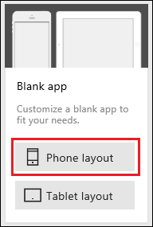

<properties
   pageTitle="Create a data source by using a formula | Microsoft PowerApps"
   description="Build a data source using only a formula and, later, use the data source to build galleries."
   services=""
   suite="powerapps"
   documentationCenter="na"
   authors="v-subohe"
   manager="anneta"
   editor=""
   tags=""/>

<tags
   ms.service="powerapps"
   ms.devlang="na"
   ms.topic="get-started-article"
   ms.tgt_pltfrm="na"
   ms.workload="na"
   ms.date="05/15/2017"
   ms.author="v-subohe"/>

# Create a data source using a formula
In this section, we'll add a data source by using a formula, and eventually, we'll use the data source we created to build galleries. The steps in this section are intended for PowerApps Desktop. When using PowerApps in a web browser, the steps will vary slightly.

## Create a data source
<!--Add a link to the resources text file here with the link on the word 'resources' in 1st sentence -->
In resources, there's a text file called *CollectionDataFormula.txt*. This file contains a large formula that we'll use to create a table of data that lists the sales figures for each city. The formula uses the function **ClearCollect** to delete all records from a collection and then add a different set of records to the same collection. In this example, **CitySales** will be the name of the collection we create.

**Note:** In the text file, some words, such as **City**, are followed by a colon(:). These words represent column headers in a table. The words that follow the column headers are in quotes and represent the value for that column header.

To create a collection to use in the galleries, first select all of the data in the text file.

1. With *CollectionDataFormula.txt* open, select all of the text in the file (for example, press Ctrl+A), copy it (Ctrl+C), and then paste (Ctrl+V) the text into NotePad.

  **Note:** It's recommended to use NotePad when copying and pasting the data because if another application is used, some of the copied text could be altered and won't work in PowerApps (for example, curly quotes).

2. Open PowerApps, click or tap **New** on the **File** menu (near the left-hand edge).

3. On the **Blank app** tile, click or tap **Phone layout**.

  

  After you do this, a new screen in PowerApps appears.

4. Go to **OnVisible** in the **Property** list in the left-hand pane.

5. In the formula bar next to **OnVisible**, paste the data that's copied from *CollectionDataFormula.txt* (the data contains the function **ClearCollect** with a list of sales figures from several countries and cities). To see the entire formula, scroll to the right and make the formula bar larger. The pasted information appears in different colors to help us make sure that the information was correctly copied over.

6. On the **Insert** tab, click or tap **New Screen** near the top of the PowerApps window to create a new screen. This creates a trigger for the **OnVisible** property so that the collection is built.

7. On the **View** tab, click or tap **Collections** and make sure the table we created is there. We won't see all of the data in the table, only the first five rows. Review the table to make sure we have all of the data.

8. In the left-hand pane, click or tap **Save As** (or press Ctrl-S) to save the app we created. Make sure to save the app to the cloud, give it an appropriate name, and provide a description. A helpful tip when saving an app is to change the icon. This makes the app stand out in the list and people can easily find it.

<!--Audrie ends the video by not saving the app, and she starts the next video by having you save the app created in the first video. I thought it would be best to include a step here on saving your app -->
