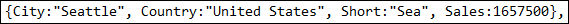
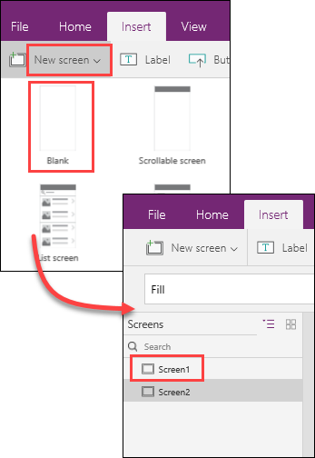
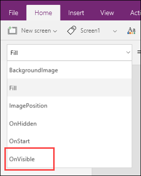
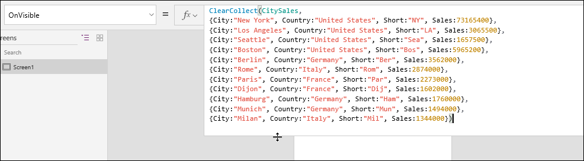
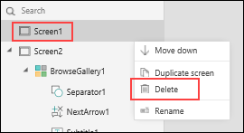
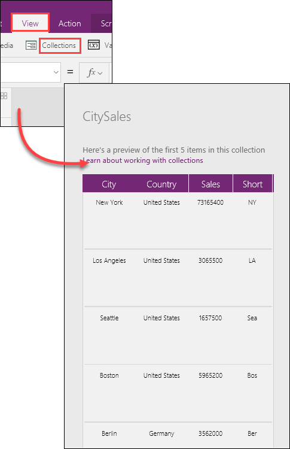
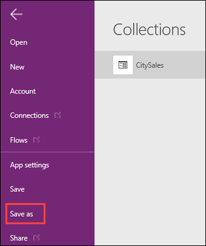

<properties
   pageTitle="Create a data source by using a formula | Microsoft PowerApps"
   description="Build a data source using only a formula and, later, use the data source to build galleries."
   services=""
   suite="powerapps"
   documentationCenter="na"
   authors="v-subohe"
   manager="anneta"
   editor=""
   tags=""/>

<tags
   ms.service="powerapps"
   ms.devlang="na"
   ms.topic="get-started-article"
   ms.tgt_pltfrm="na"
   ms.workload="na"
   ms.date="07/31/2017"
   ms.author="v-subohe"/>

# Create a data source using a formula
In this section, you'll use a formula to create a data source, which you'll then use to build a gallery in the next section. The steps in this section are intended for PowerApps Studio for Windows. When using PowerApps Studio for Web, the steps may vary slightly.

## Collections and records

In the resources for this section, you'll find a text file named *CollectionDataFormula.txt*. This file contains a large formula that you'll use to create a collection that lists the sales figures for different cities. The formula uses the **ClearCollect** function, which clears, or deletes, all the records from a collection and then adds a different set of records to the same collection. If the collection doesn't exist, it will create the collection. In this example, you'll use it to create a collection named **CitySales**.

**Note:** The data in the text file is formatted specifically for the **ClearCollect** function. As an example, the complete row for Seattle sales is shown here:

  
  - The data between each set of curly braces "**{ }**" is a single record, or row. 
  - Column names are immediately followed by a colon (**:**), for example "**City:**".
  - The value for each column in a record comes after the colon (**:**) and ends with a comma (**,**). Numerical values are written without quotes, but text values must be in quotes, for example, **City:"Seattle",** and **Sales:1657500**. 

## Create a collection

To create a collection to use in the galleries, first select all of the data in the text file.

1. Use NotePad to open *CollectionDataFormula.txt*, select all of the text in the file (for example, press Ctrl+A), and copy it (Ctrl+C).

   **Note:** It's recommended to use a text editor such as NotePad to open and copy the data. Using a word processor, such as Word, can introduce unintended formatting into the text which PowerApps won't recognize, for example, curly quotes.
   

2. Open PowerApps, and click or tap **New** on the **File** menu (near the left-hand edge).

3. On the **Blank app** tile, click or tap **Phone layout**.

   

   A new app with a blank screen will open in the PowerApps workspace.

1. On the **Home** tab, click or tap **New Screen**, and select **List screen** to create a new screen. The default list template will appear in the app. 

    

4. With the new screen selected, click **OnVisible** in the **Property** list drop-down.

   

5. In the formula bar next to **OnVisible**, paste the data that you copied from *CollectionDataFormula.txt*. (The data contains the  **ClearCollect** function with a list of sales figures from several countries and cities). To see the entire formula, expand the formula bar by dragging down the bottom edge. Notice that the information displays in different colors - column names in black, text values in red, and so on - to make it easier to see the information.

   

1. In the left-hand pane, select the first screen, click the properties  menu **(...)**, and select **Delete**.

    

7. On the **View** tab, click or tap **Collections** and make sure the table was created. You won't see all of the data in the table, only the first five rows. Review the table to make sure all of the data is there.

   

8. In the left-hand pane, click or tap **Save As** (or press Ctrl-Shift-S) to save the app. Make sure to save the app to the cloud, give it an appropriate name, and provide a description. A helpful tip when saving an app is to change the icon. This makes the app stand out in the list and people can easily find it.

   

