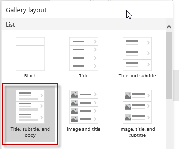

<properties
   pageTitle="Create a gallery from the data in a collection | Microsoft PowerApps"
   description="Create a gallery from the data in a collection and change some of the fields"
   services=""
   suite="powerapps"
   documentationCenter="na"
   authors="v-subohe"
   manager="anneta"
   editor=""
   tags=""/>

<tags
   ms.service="powerapps"
   ms.devlang="na"
   ms.topic="get-started-article"
   ms.tgt_pltfrm="na"
   ms.workload="na"
   ms.date="05/15/2017"
   ms.author="v-subohe"/>

# Create a gallery from the data in a collection
In this topic, we'll create a gallery using the data in a collection and then change some of the fields in the gallery template.

If the app created in the previous topic isn't saved, save it now. In the left-hand pane, click or tap **Save As** (or press Ctrl-S). Make sure to save the app to the cloud, give it an appropriate name, and provide a description.

## Create a gallery from the data in a collection
Before creating a gallery, select a layout and theme for the app.

1. In the right-hand pane, click or tap a layout that you want to use.

  

2. On the **Home** tab, click or tap **Theme**. Select the theme to use in the app before starting to add the controls because once a theme is selected, PowerApps will automatically color the controls to fit the theme.

  **Note:** If PowerApps is run from a web browser, the **Theme** icon may not be displayed.

3. The gallery doesn't yet have the right data. To display the correct data, click or tap the gallery. Notice that in the lower left-hand corner, the name of the selected gallery is shown.

4. In the formula bar, there's a long function that's already built. Do the following three tasks in the formula bar:
  - Change the sample data source in the function to the data source to use (in the example, the data source is **CitySales**).
  - Change the column name to search by to the column name from the table.
  - Change the column name to sort by to another column name from the data source.

  Continue to add functionality to the data by changing the variables in the function.

## Change elements in the gallery template
To customize the gallery, change some of the elements or fields. For example, to change the title of the gallery, click or tap in the title area of the gallery to select it. Then, in the formula bar, type a new title (in the example, the title is changed to **Flooring Sales**).

Hide the "add new" (+) icon in the title area of the gallery because we probably won't add any new items. To do this, click or tap in the area around the (+) icon to select it and click or tap **Visible** in the property list. Then, in the formula bar, change the variable to **false** to hide the button.
<!--(Audrie shows a few other examples for customizing, mostly along the same lines as the previous 2 examples.) -->
