<properties
   pageTitle="Customize a gallery template | Microsoft PowerApps"
   description="Format fields, align multiple fields, and change colors to customize a gallery template"
   services=""
   suite="powerapps"
   documentationCenter="na"
   authors="v-subohe"
   manager="anneta"
   editor=""
   tags=""/>

<tags
   ms.service="powerapps"
   ms.devlang="na"
   ms.topic="get-started-article"
   ms.tgt_pltfrm="na"
   ms.workload="na"
   ms.date="08/06/2017"
   ms.author="v-subohe"/>

# Customize a gallery template
In this topic, you'll see how to customize the gallery template by formatting fields, aligning multiple fields, and changing a background color.

## Format fields
1. In the **Flooring Sales** example we've been discussing, the sales figure may be difficult to recognize as currency in its current format. To reformat the sales figure to make it clearer that it's currency, select the field that shows the sales figure in the gallery. The value that exists for each sales item is represented as **ThisItem.Sales**.

   In the formula bar, click or tap directly in front of **ThisItem** and enter this **Text** function around **ThisItem.Sales**:

   **Text(ThisItem.Sales,"$#,#00")**

   The sales figures now display in a currency format.  

     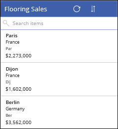

   **Note:** If you're familiar with Microsoft Excel, the custom number formats in PowerApps are similar.

2. To further clarify what the currency value represents, you can add a text in front of the value. Modify the formula as follows:

   **"Total Sales: " & Text(ThisItem.Sales,"$#,#00")**

     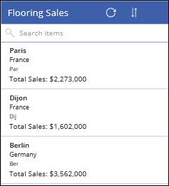

## Arranging the fields in a template

When data is loaded into a gallery template, it's not necessarily formatted or laid out the way you want it. In this section, you'll arrange the fields so that it's more readable for the user.

First, we'll change the width of the **City** and **Short** fields so they don't overlap with other fields.

1. Select the **City** field, and select **Width** in the property drop-down list. By default, this is set to **Parent.TemplateWidth - [some value]**. One of the ways to change the width of fields consistently is to divide the template by 2 or 4, so that the field only uses half or one-quarter of the width of the template. For this example, enter **Parent.TemplateWidth/4** in the formula bar, so the field occupies only one-quarter of the template width. Make the same changes to the **Short** field. 

2. After reducing the size of the **City** and **Short** fields, move the **Short** field to the upper right of the template, and move the **City** field underneath it.

     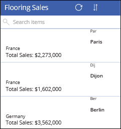

3. Select the **Country** field and increase the font size (the **Size** property). Move the **Country** field toward the top of the template. Select the **Sales** field, and move it underneath the **Country** field. 

     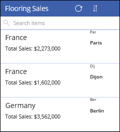

4. Move the **City** field down so that it's lined up with the **Sales** field. Note that as you drag a field, or any control, PowerApps displays alignment guides. In this example, the **City** field aligns horizontally with the **Sales** field, and vertically, the left edge aligns with the **Short** field.  

     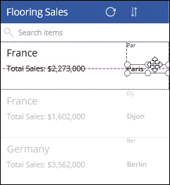

## Align multiple fields in a template

In addition to the built-in alignment guides, you can use the Crtl key to select multiple fields to align. Say, for example, while arranging fields, you moved the **Sales** field too far to the right.

 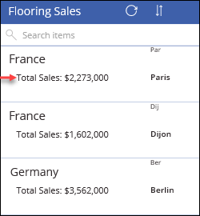

Hold down the Ctrl key and select both the **Country** and **Sales** fields. Then, on the **Home** tab, click or tap **Align**, and select **Align left**.

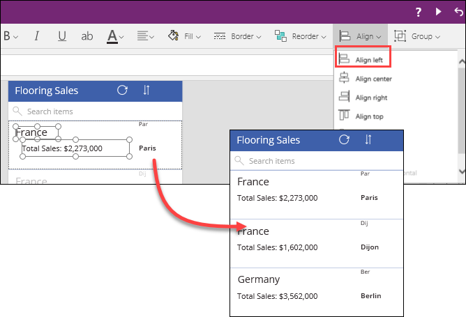

  **Note:** As you move fields around the template, be careful that fields don't overlap each other. For example, if the **City** field is moved next to the **Sales** field, and the **Sales** field contains a very large number, it may hide the city name. To reduce the size of the field that's overlapping another field, drag the corner of a field to make it smaller. To move a field, grab the edge and move it. As the field is moved, PowerApps automatically aligns it.

After arranging the fields, if the template has too much blank space, you can drag the bottom edge of the template up to reduce the overall size.

## Change the background color, padding, and size of a template

There are three gallery template properties that are particularly useful when laying out your gallery: **TemplateFill**, **TemplatePadding**, and **TemplateSize**. 

### TemplateFill
To change the background color of the template, select **TemplateFill** in the property list. In the formula bar, delete the current color and change it to a different color, such as **LightGray**. The background changes to light gray.

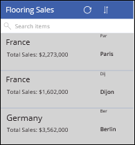

Another way to use the **TemplateFill** property is to change the color of an item when it is selected. You can use an **If** function to set the color of an item when it is selected, and then set it back to the original color when it's not. Add this formula to the **TemplateFill** property: 

  **If(ThisItem.IsSelected,LightBlue,White)**

  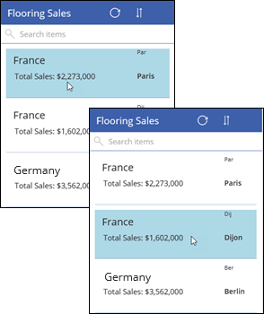

When the item is selected, the background color changes to light blue, otherwise, it remains white.

### TemplatePadding
The **TemplatePadding** is the space around the edge of the template. To add padding to a template, select **TemplatePadding** in the property list and set the padding size in the formula bar. The following example shows a **TemplateFill** of **LightGray**, and a **TemplatePadding** of **20**.

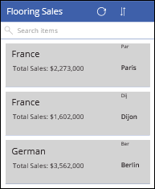

### TemplateSize

You saw earlier how to drag the handles of the template to change the size. However, you can set the size of the template to adjust automatically to the size of the data that it displays. In the **TemplateSize** property, enter this formula: 

**Subtitle2.Height + Label1.Height + 20**

**Note:** This example assumes the **Country** field is named **Subtitle2** and the **Sales** field is named **Label1**. Use the names that apply to your app.

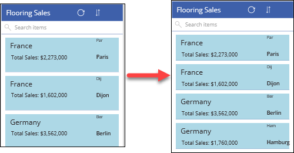

This formula adds the height of the **Country** field and the height of the **Sales** field, plus a buffer of **20**. If either field expands to accommodate a large of amount of data, the template will expand automatically, too. 