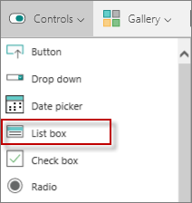

<properties
   pageTitle="Sort data in a gallery using the GroupBy function | Microsoft PowerApps"
   description="Group together specific data in a gallery based on certain values"
   services=""
   suite="powerapps"
   documentationCenter="na"
   authors="v-subohe"
   manager="anneta"
   editor=""
   tags=""/>

<tags
   ms.service="powerapps"
   ms.devlang="na"
   ms.topic="get-started-article"
   ms.tgt_pltfrm="na"
   ms.workload="na"
   ms.date="05/31/2017"
   ms.author="v-subohe"/>

# Sorting data in a gallery using the GroupBy function
Group together specific data in a gallery based on certain values using the **GroupBy** function.

In the **CitySales** example, we want to group the sales data by country so that each country is displayed in a single row with all of the data for that country displayed in the same row.

## Create a gallery with flexible height
1. On the **Insert** tab, click or tap **New screen** to create a new screen.
<!-- In the video, Audrie talks about creating a new screen first, but I don't think this is necessary-->

2. On the **Insert** tab, click or tap **Gallery**, and then click or tap **Flexible height**. The gallery that appears doesn't have any custom templates associated with it, so you'll need to format the flexible gallery.

  

3. In the left-hand pane, click or tap **Items** in the property list (it may already be selected). In the formula bar, replace **CustomGallerySample** with **CitySales**. Now the gallery is connected to the **CitySales** collection.

4. In the upper left-hand corner of the gallery, click or tap the pencil icon to select the gallery template.

5. On the **Insert** tab, click or tap **Label** to insert a text box. The new text box defaults to **City**. In the right-hand pane, under **TextBox**, change **City** to **Country**.

**Note:** The top template in the gallery is larger than the others, but the gallery adjusts when opened in preview mode.

## Group together specific data in the gallery
1. With the **Items** property selected for the gallery, add the **GroupBy** function. In the formula bar next to the **Items** property, type the following:
**GroupBy(CitySales,"Country","Cities")**

  The data from **CitySales** is grouped by country with **Cities** as the name of the group you've created. The values for **column_name** and **group_name** must be in quotes.

2. Since there's more than one city for each country in the example, add a control that handles more than one item. On the **Insert** tab, click or tap **Controls**, and then click or tap **List box**. Make sure you are in the template before you insert the list box control.

  

3. Resize or move the list box control so that it fits in the template.

4. For the **Items** property of the list box control, change **ListBoxSample** to **Cities** in the formula bar. The gallery displays each country in a separate row with the country's cities grouped with it.
