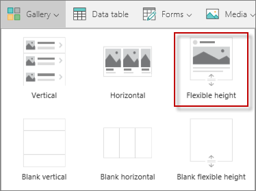
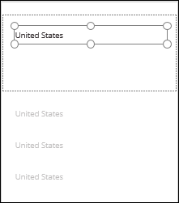
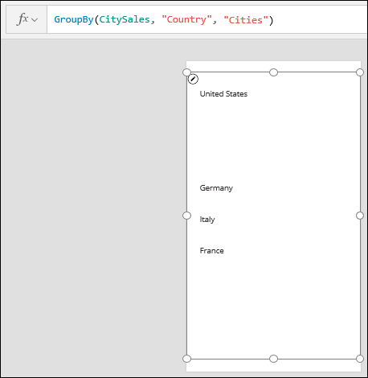
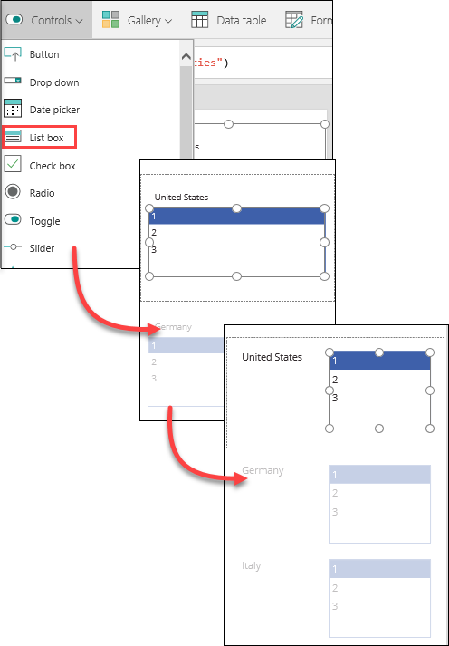
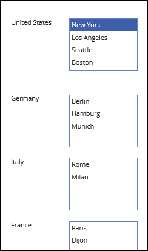

<properties
   pageTitle="Sort data in a gallery using the GroupBy function | Microsoft PowerApps"
   description="Group together specific data in a gallery based on certain values"
   services=""
   suite="powerapps"
   documentationCenter="na"
   authors="v-subohe"
   manager="anneta"
   editor=""
   tags=""/>

<tags
   ms.service="powerapps"
   ms.devlang="na"
   ms.topic="get-started-article"
   ms.tgt_pltfrm="na"
   ms.workload="na"
   ms.date="05/31/2017"
   ms.author="v-subohe"/>

# Sorting data in a gallery using the GroupBy function
Using the **GroupBy** function, you can group data together based on certain values, and display it a gallery.

Using the **CitySales** example, you'll group the sales data by country so that each country is displayed in a single item with all of the data for that country displayed next to it.

## Create a gallery with flexible height
1. On the **Insert** tab, click or tap **New screen**, and select **Blank screen** to create a new screen. 

2. On the **Insert** tab, click or tap **Gallery**, select **Blank flexible height**, and expand the gallery to the bottom of the screen. 

   

3. In the property list, select **Items**. In the formula bar, replace **CustomGallerySample** with **CitySales**. Now the gallery is connected to the **CitySales** collection.

4. In the upper left-hand corner of the gallery, click or tap the pencil icon to select the gallery template.

5. On the **Insert** tab, click or tap **Label** to insert a text box. In the formula bar, replace the default value with **ThisItem.Country**. 

   

## Group specific data together in the gallery

Note that the country for each item is displayed in the gallery, and because there are multiple cities for each country, each country is displayed multiple times. You can use the **GroupBy** function to group all the items for a country together. 

Select the gallery (not the gallery template), and replace **CitySales** in the **Items** property with this **GroupBy** function:
**GroupBy(CitySales,"Country","Cities")**

This formula takes the data from **CitySales** and groups it together by country. It also creates a group named **Cities** that holds the rest of the data for each country group.  

  

Next, add a **List box** control to the gallery template. On the **Insert** tab, click or tap **Controls**, and then click or tap **List box**. Resize or move the list box control so that it fits in the template next to the **Country** field.

   

To display the data in the list box, set the **Items** property of the list box control to **Cities**. 

Preview the app. The gallery displays each country in a separate item with the associated cities grouped next to it.

   
