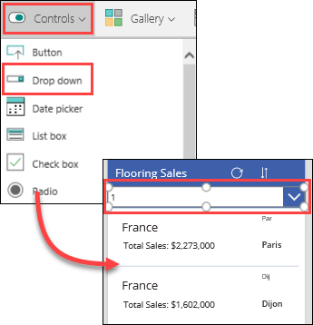
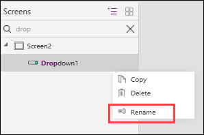
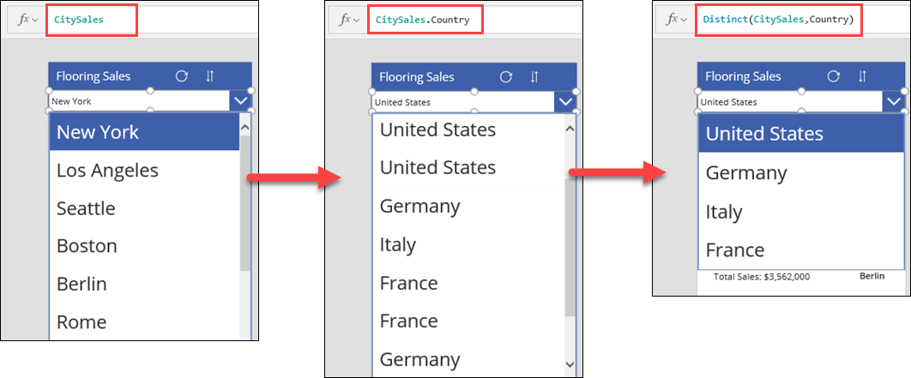
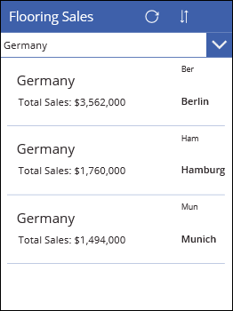

<properties
   pageTitle="Filter a gallery using a drop-down control | Microsoft PowerApps"
   description="Quickly filter data in a gallery using a drop down control"
   services=""
   suite="powerapps"
   documentationCenter="na"
   authors="skjerland"
   manager="anneta"
   editor=""
   tags=""/>

<tags
   ms.service="powerapps"
   ms.devlang="na"
   ms.topic="get-started-article"
   ms.tgt_pltfrm="na"
   ms.workload="na"
   ms.date="10/06/2017"
   ms.author="sharik"/>

# Using a drop-down control to filter data in a gallery
When you generate an app from a data source, the app that's created includes a search box. Another way to search for data in a gallery is to filter the results using a drop-down control.

In this topic, you'll create a drop-down control that lets you filter data by the country selected in the control.

## Create a drop-down control
On the **Insert** tab, click or tap **Controls**, and then click or tap **Drop down**. When the drop-down control appears in the gallery, drag and resize it so it fits below the title bar and above the gallery template.

In the left-hand pane, search for **Dropdown1**, click or tap the **...** menu, select **Rename**, and then type a name for the drop-down control. For this example, name the drop-down control **ddCountry**, because you'll set it up to filter on the **Country** field.

## Select data to filter
Select **Items** in the property list for the drop-down control, and then in the formula bar, change the value to **CitySales**. If you click the drop-down arrow, you'll see that only the **City** values are listed. Because a column wasn't specified in **Items**, PowerApps returned the first column by default.

Change the formula to **CitySales.Country**, and notice that the drop-down control now displays all of the **Country** values. However, there are duplicates, because several cities have the same country. You can remove the duplicates by using the **Distinct** function:

**Distinct(CitySales, Country)**

If the **Distinct** function detects multiple instances of a value, it displays only one of them.

## Select data to display in the gallery

Now you want to connect the drop-down control to the gallery. Click or tap the gallery to select it, and then select **Items** in the property list. In the formula bar, delete all of the existing text, and then type or paste the following:

**Filter(CitySales,ddCountry.Selected.Value in Country)**

The gallery is now set to filter the **CitySales** data by the country that's selected in the drop-down.

In the next topic, you'll explore how to sort data in a gallery.
