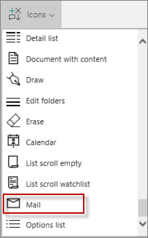
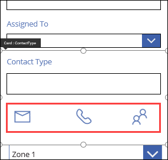
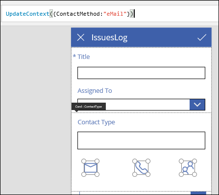
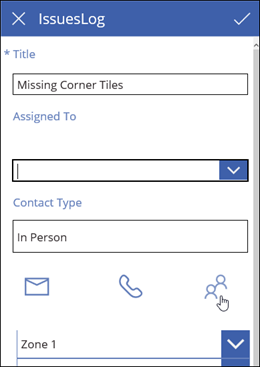

<properties
   pageTitle="Add icons to forms | Microsoft PowerApps"
   description="Add icons to forms"
   services=""
   suite="powerapps"
   documentationCenter="na"
   authors="v-subohe"
   manager="anneta"
   editor=""
   tags=""/>

<tags
   ms.service="powerapps"
   ms.devlang="na"
   ms.topic="get-started-article"
   ms.tgt_pltfrm="na"
   ms.workload="na"
   ms.date="08/05/2017"
   ms.author="v-subohe"/>

# Adding icons to forms
When creating apps for devices with smaller screens, such as mobile devices, drop-down lists aren't the ideal way for users to interact with an app. Instead, on a mobile device, it works better to use something such as large buttons or obvious images to select options in an app.

In this example, you'll add icons to your app so that users can select an option for **Contact Type** by clicking or tapping an icon. This is a better solution for mobile devices than making a drop-down list for the **Contact Type** field.

## Add icons to the form ##
1. On the **IssuesLog** edit form, click or tap the **Contact Type** data card, select the lower edge of the field, and then drag it down to make room for three icons arranged horizontally.

1. On the **Insert** tab, click or tap **Icons**. Scroll down to locate the **Mail** icon, select it, and position it under the **Contact Type** field.

    

1. Add the **Phone** and **People** icons, and arrange all three under the **Contact Type** field.

    

## Add a variable to the icons

Use the **UpdateContext** function to create a variable so that when a user clicks or taps an icon,  **Contact Type** is automatically filled in.

1. Select the **Mail** icon and add the following formula to the **OnSelect** property:

    **UpdateContext({ContactMethod:"eMail"})**

    

1. Update the **OnSelect** property for the remaining icons:

    - **UpdateContext({ContactMethod:"Telephone"})**
    - **UpdateContext({ContactMethod:"In Person"})**

1. Select the **Contact Type** field, and in the right pane on the **Advanced** tab, unlock the field so you can change its properties.  

1. Type the variable name, **ContactMethod**, into the **Default** property.

1. Test the app by selecting each icon and making sure that the selected value appears in **Contact Type**.

    

This is just one way to design your app to look more professional, and to be mobile friendly for your users. 

