<properties
   pageTitle="Overview of Mobile Player | Microsoft PowerApps"
   description="Exploring the PowerApp mobile player"
   services=""
   suite="powerapps"
   documentationCenter="na"
   authors="v-brbene"
   manager="anneta"
   editor=""
   tags=""
   featuredVideoId="os33pHQ9jSU"
   courseDuration="5m"/>

<tags
   ms.service="powerapps"
   ms.devlang="na"
   ms.topic="get-started-article"
   ms.tgt_pltfrm="na"
   ms.workload="na"
   ms.date="08/17/2017"
   ms.author="v-brbene"/>

# Overview of the PowerApps mobile player

In this topic, we'll look at the PowerApps mobile player. The mobile player is available for the iOS, Android, and Windows mobile devices. Fortunately, you only have to create one app, and the mobile player makes sure that your users can run the app on multiple devices.

## Getting started

To get started, download the player from the app store for your device. The iOS and Android stores are shown here. 

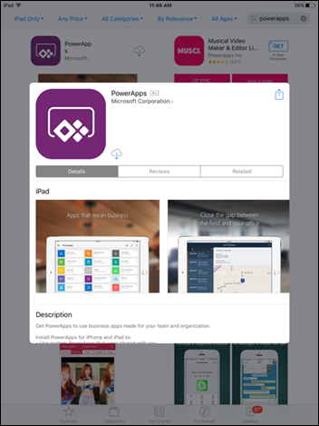
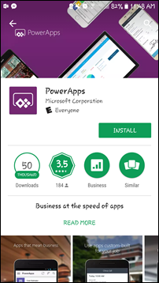

1. After you install and launch the player, you'll need to login with your company user account. 

    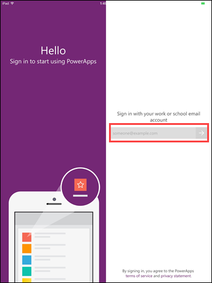
    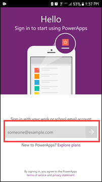

1. When you first login, you will see a list of sample apps that have been provided by Microsoft.  These apps are made available for you to try out and play with in advance.  Tap **Asset Checkout** to take a look at that app. 
 
    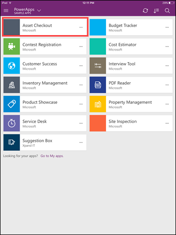

1. The **Asset Checkout** app is useful for organizations with users that need to borrow equipment for offsite visits, such as customer engagements. This app allows them to select the equipment they need and reserve it.  Click on **Mice**. 

    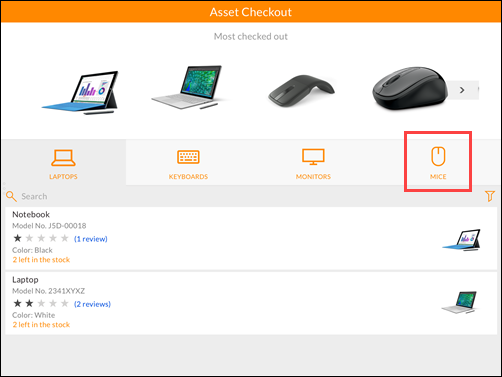

    **Note:** You can customize this app for your own organization using the **Asset Checkout** template from the PowerApps home page. 

    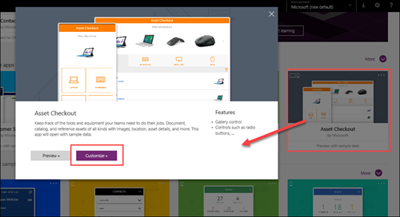

1. The gallery page opens with an inventory list, including a picture, a description, number available, and a user rating.  Select **Wired mouse**, then click **Checkout**. Enter a number in **Reserved days** and then click **Reserve**.

    

    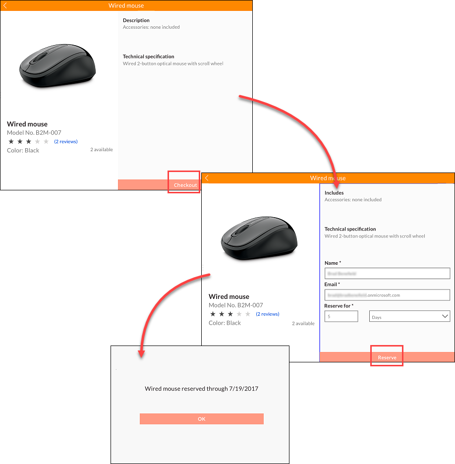

1. Slide right to close the app and return to the list of apps. If you like the **Asset Checkout** app, you can tap on the 3-dot menu and pin it to your home page, or you can mark it as a **Favorite** from the PowerApps dropdown list.

    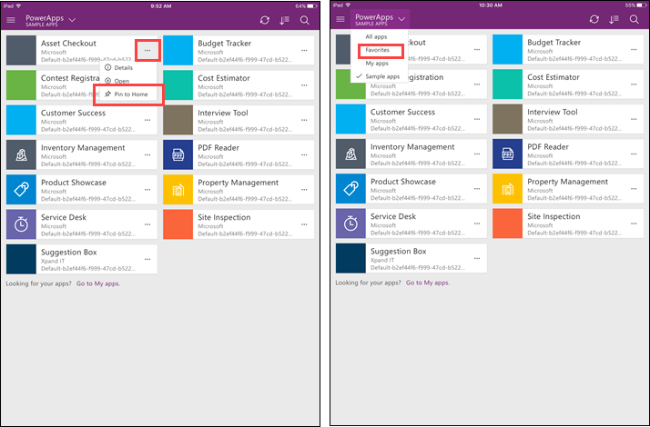

1. Using the buttons in the upper right, you can refresh the page, or sort and search for apps.

    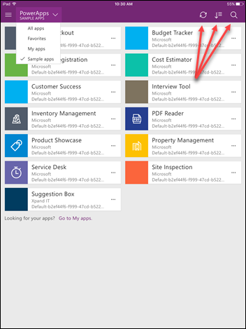

1. Close the mobile player by using the same method that you would with any other app on your device. You can also sign out of the player by clicking the upper left menu and selecting **Sign out**. For security, you will need to sign in again with your account the next time you run the mobile player. 

    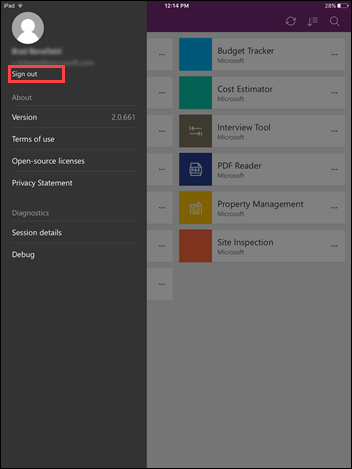

The PowerApps mobile player provides a common interface for users to access organizational apps.  Test out the mobile player on some of your devices, and then invite your users to experience how easy it is to access their favorite apps on the go.  

