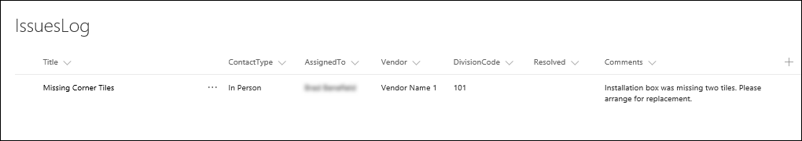
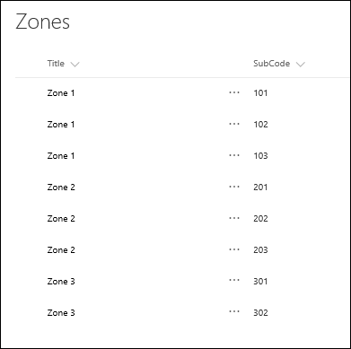

  <properties
   pageTitle="Add data to SharePoint to prepare to create an app | Microsoft PowerApps"
   description="Build additional data into SharePoint to prepare for creating an app"
   services=""
   suite="powerapps"
   documentationCenter="na"
   authors="v-subohe"
   manager="anneta"
   editor=""
   tags=""/>

<tags
   ms.service="powerapps"
   ms.devlang="na"
   ms.topic="get-started-article"
   ms.tgt_pltfrm="na"
   ms.workload="na"
   ms.date="08/05/2017"
   ms.author="v-subohe"/>

# Building a SharePoint list to use in an app
In previous topics, you've created apps related to flooring. Now, you'll create an app for the workers who are installing the flooring. This app lets them log any issues they encounter on a job. It will store the data in a SharePoint Online list, and workers can add issues to the list using the app.

## Add a new SharePoint list 
In this topic, you'll create two SharePoint lists that you'll use to build the app over the next several topics.  

On your SharePoint site, create a new custom list, and name it **IssuesLog**.  After SharePoint creates it, open the **IssuesLog** list from the site's **Contents** page. 

## Add columns to the list 

In the **IssuesLog** list, create six new columns.

| Data type | Column name |
|-----------|-------------|
| Single line of text | ContactType |
| Person | AssignedTo |
| Choice** | Vendor|
| Single line of text | DivisionCode |
| Yes/No | Resolved |
| Multiple lines of text | Comments |

** Use these additional column settings for Vendor (Type each choice on a separate line): 

- Vendor Name 1 (Default value)
- Vendor Name 2
- Vendor Name 3

Add one new item to the list so that something displays when you build the app. Click or tap **New** in the upper left-hand corner, and in **New Item**, add some data in each field in the list. Click or tap **Save** to save the item.

After creating the columns and adding an item, your SharePoint list should look similar to this:

## Add another list for the DivisionCode field 

Contoso Flooring uses three division zones, and each zone has multiple codes. In the app, you'll want to select a zone and see only the codes for that zone. You'll do this in the app by using a cascading drop-down list. To populate the drop-down list, you need another SharePoint list.

Create a new custom list, and name it **Zones**. After SharePoint creates it, open the **Zones** list from the **Contents** page.

Add one new column to the list.

| Data type | Column name |
|-----------|-------------|
| Single line of text | SubCode |

Click or tap **Quick edit** in the upper left-hand side to add the zones. In the table that appears: under the **Title** column type each zone, and under the **SubCode** column type each subcode. For example:

- **Zone 1** : **101**
- **Zone 1** : **102**
- **Zone 1** : **103**
- **Zone 2** : **201**
- **Zone 2** : **202**
- **Zone 2** : **203**
- **Zone 3** : **301**
- **Zone 3** : **302** 

After saving the edits, your SharePoint list should look similar to this:

In the next topic, we'll discuss how to build the app.
