<properties
   pageTitle="Understand the basics of formulas | Microsoft PowerApps"
   description="Formulas are the key to making PowerApps work"
   services=""
   suite="powerapps"
   documentationCenter="na"
   authors="v-subohe"
   manager="anneta"
   editor=""
   tags=""
   featuredVideoId=123
   courseDuration=/>

<tags
   ms.service="powerapps"
   ms.devlang="na"
   ms.topic="get-started-article"
   ms.tgt_pltfrm="na"
   ms.workload="na"
   ms.date="08/06/2017"
   ms.author="v-subohe"/>

# Using formulas in PowerApps

This topic provides a look at the formula bar, formulas, and how to use them in PowerApps. The formula bar is located at the top of PowerApps, and is similar to what you'd see in Excel. Formulas in PowerApps are also based on the formulas in Excel.

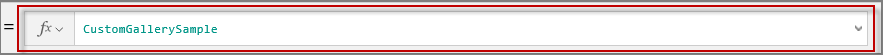

**Note:** To try out the examples in this topic, open or create any basic app in PowerApps. For this topic, the examples start with a blank phone app.

## Find available functions on the formula bar
On the formula bar, click or tap the **fx** button to browse available functions. For example, the options under the **Text** category are common text functions, such as **Left** (returns a specified number of characters from the left side of a text *string*, i.e. a piece of text) and **Concatenate** (combines two strings together).

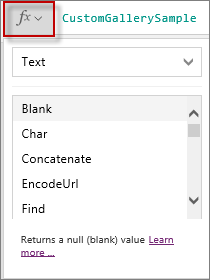

Let's look at the **Left** function first:.

1. Add two labels to the app screen.
1. Change the **Text** property of the first label, to something like **Marketing**.
1. In the **Text** property of the second label, type:

**Left(Label1.Text, 3)**

This function will return the first three characters of the text in the **Label1** field. 

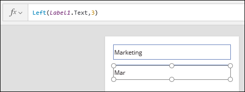 

The **Concatenate** function combines two text strings together into one string. The strings can either be the value of a field, or a literal string, enclosed in quotes.

1. Add a third text field to your screen, between the two you already added.

1. Enter some text, for example **M101**.

1. Change the **Text** formula in **Label2** from using ***Left** to using **Concatenate**:

**Concatenate(Label1.Text, Label3.Text)**

If you need to make it more readable, you can insert a space in between:

**Concatenate(Label1.Text, " ", Label3.Text)**

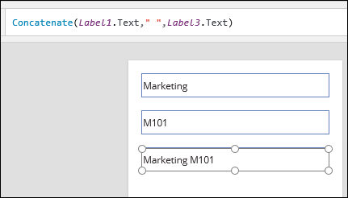 

You can also concatenate text strings using the ampersand, "**&**". Replace the formula with this:

**"Department: " & Label1.Text**

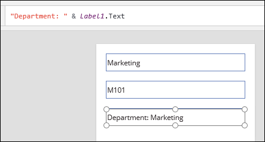

## Formula bar colors

The formula bar uses color coding to help identify the types of values - strings, fields, numbers, etc. - and to help validate your formulas.

In the last example, notice that when you highlighted **Label1**, the related text field is highlighted as well to help you verify that it's the correct field. 

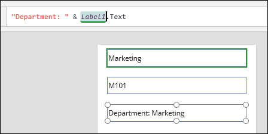

If you add another text string to the formula, **"Department: " & Label1.Text & " " & Label3.Text**, it highlights the second field in a different color.

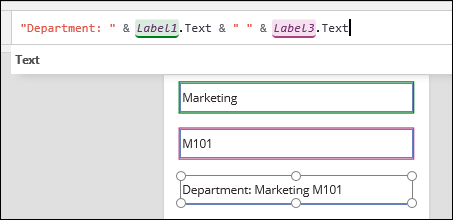

## Working with galleries

**Note**: The next few examples use a gallery that has a SharePoint list as a data source. To follow along, add a gallery to your screen, and connect to a SharePoint list.

Select any field in the gallery, and you'll see that **ThisItem** is highlighted in red to show that this is a data source field.

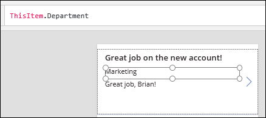

You can also apply functions to data source fields, for example:

**Left(ThisItem.Department,4)**

This works the same as it did with a literal text string.   

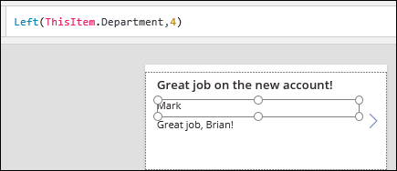

The color coding also warns you about invalid formatting. For example, if you leave off a closing parentheses, a red dot will remind you that something is missing. Also, notice the color coding here: the function name is blue, the data source is red, and the number is dark yellow.

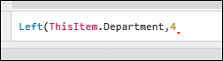

For our last example, we'll add a field for a drop-down item in the SharePoint list. It's named **FollowUp**, and it's a Choice drop-down with three values. These are the field values as configured in SharePoint:

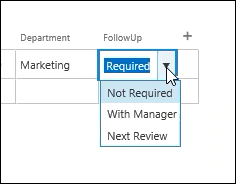

In your gallery template, add a new text field, and set the **Text** property to:

**ThisItem.FollowUp**

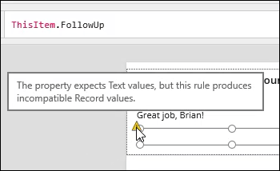

Even though **FollowUp** is available as a field, it is still invalid, as shown by the tooltip. If you add a period, the formula bar will provide a list of the available fields. Select **Value** to complete the formula.

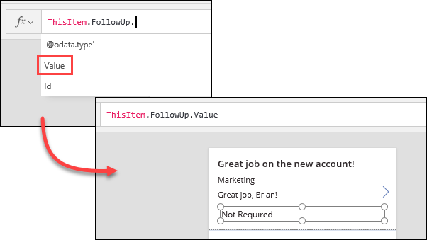

